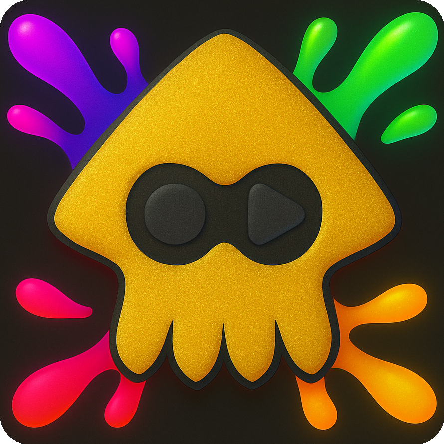
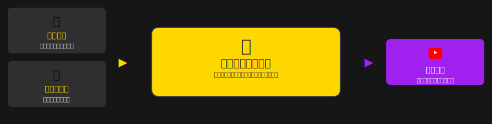
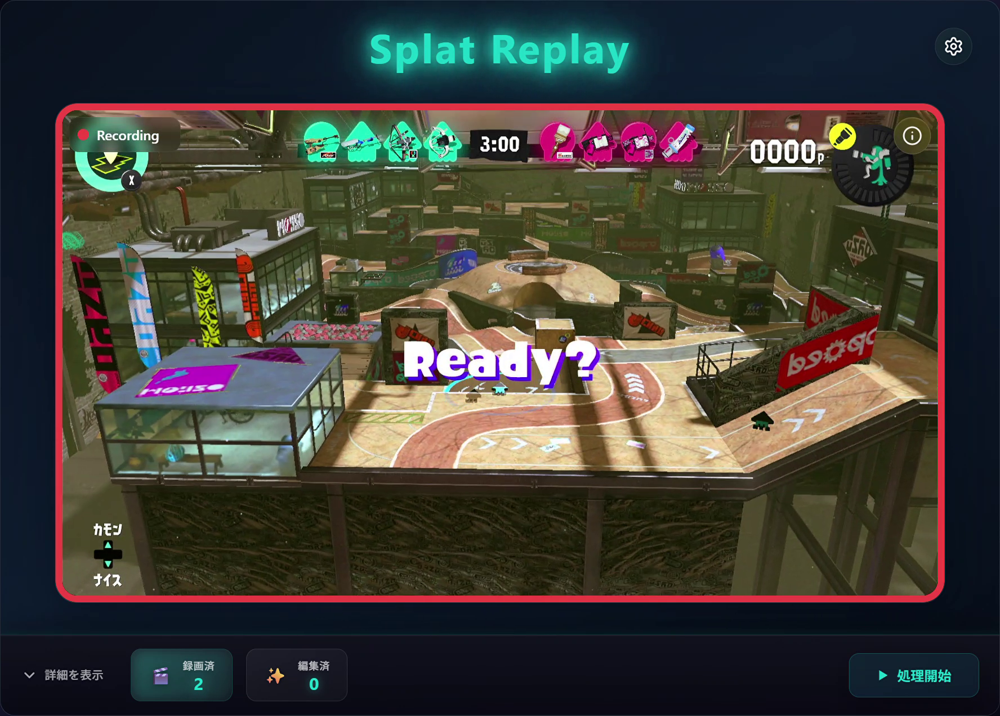

  <h1 style="display: flex; align-items: center; justify-content: center;">
    
    Splat Replay
  </h1>

Splat Replay は、スプラトゥーン 3 のプレイ動画を自動で録画・編集・アップロードするアプリです。一連の処理を自動化することで、プレイに集中しながら記録を残せます。

## 主な機能

- **自動録画**:  
  映像をリアルタイムで監視し、バトル開始・終了に応じて録画を開始・停止します。録画には OBS を使用しています。

- **自動編集**:  
  録画した動画をタイムスケジュール毎に結合し、サムネイルを自動生成します。

- **自動アップロード**:  
  編集した動画を YouTube にアップロードします。タイトル・説明・サムネイル・字幕を合わせて設定します。

## 使い方

インストール・初回設定をしたら`SplatReplay.exe`を実行するだけ

インストール方法や詳細な使用方法については [ユーザーガイド](./docs/usage.md) を参照してください。
