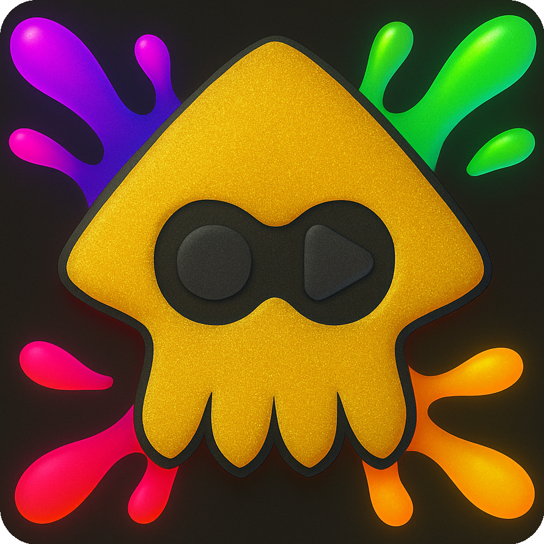
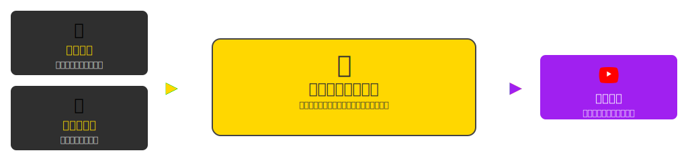
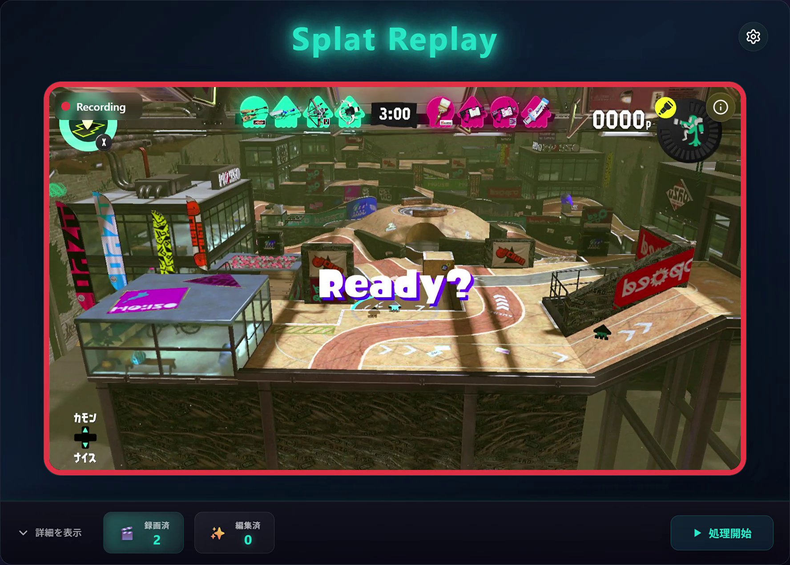

<!-- markdownlint-disable MD033 MD041 -->
<!-- 理由: アイコン付きタイトルの中央揃えには HTML が必要（MD033）、視覚的な表現を優先（MD041） -->
<!-- 将来の解消方針: GitHub の Markdown レンダリングが画像+テキストの flexbox 配置をサポートするか、別の表現方法を検討 -->

  <h1 style="display: flex; align-items: center; justify-content: center;">
    
    Splat Replay
  </h1>

<!-- markdownlint-enable MD033 MD041 -->

Splat Replay は、スプラトゥーン 3 のプレイ動画を自動で録画・編集・アップロードするアプリです。一連の処理を自動化することで、プレイに集中しながら記録を残せます。

## 主な機能

- **自動録画**:  
  映像をリアルタイムで監視し、バトル開始・終了に応じて録画を開始・停止します。録画には OBS を使用しています。

- **自動編集**:  
  録画した動画をタイムスケジュール毎に結合し、サムネイルを自動生成します。

- **自動アップロード**:  
  編集した動画を YouTube にアップロードします。タイトル・説明・サムネイル・字幕を合わせて設定します。

## 使い方

### インストール

1. [GitHub リリースページ](https://github.com/saw4405/splat-replay2/releases)にある最新のリリースから、`SplatReplay.zip` をダウンロードする
2. ダウンロードした ZIP ファイルを展開する

### 起動

1. 展開したフォルダ内の `SplatReplay.exe` を実行してアプリを起動する
2. （初回のみ）セットアップウィザードに従い、必要なアプリのインストールや設定を行う
3. スプラトゥーン 3 をプレイするだけで、自動的に録画・編集・アップロードが行われる

## 開発者向け情報

このプロジェクトの開発に参加する場合は、以下のドキュメントを参照してください：

- **[開発ガイド](./docs/DEVELOPMENT.md)** - 環境構築、テスト実行、品質確認の手順
- [テスト戦略](./docs/test_strategy.md) - テストの分類と戦略の詳細
- [動画リプレイ入力による E2E 回帰テスト](./docs/e2e_replay_test.md) - E2E テストの詳細
