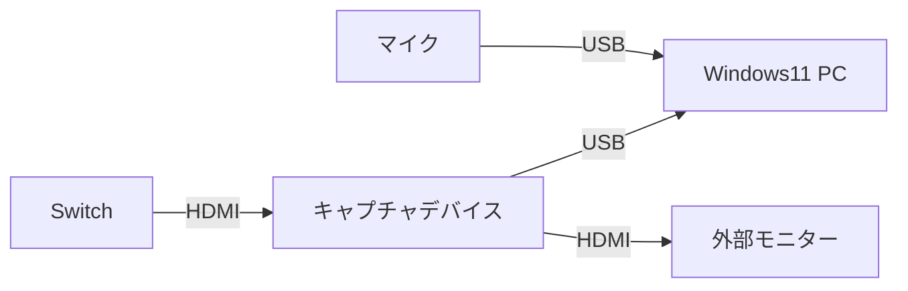
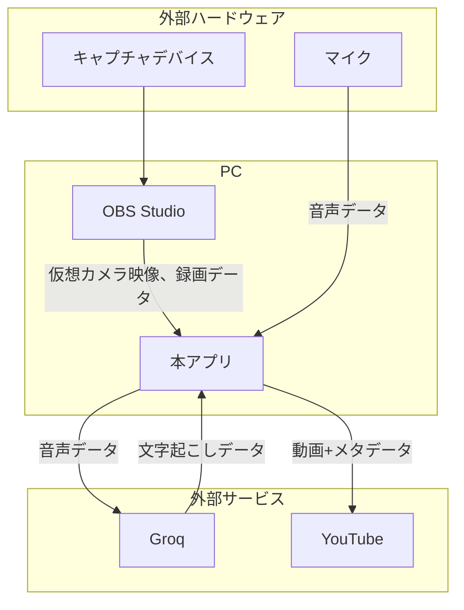
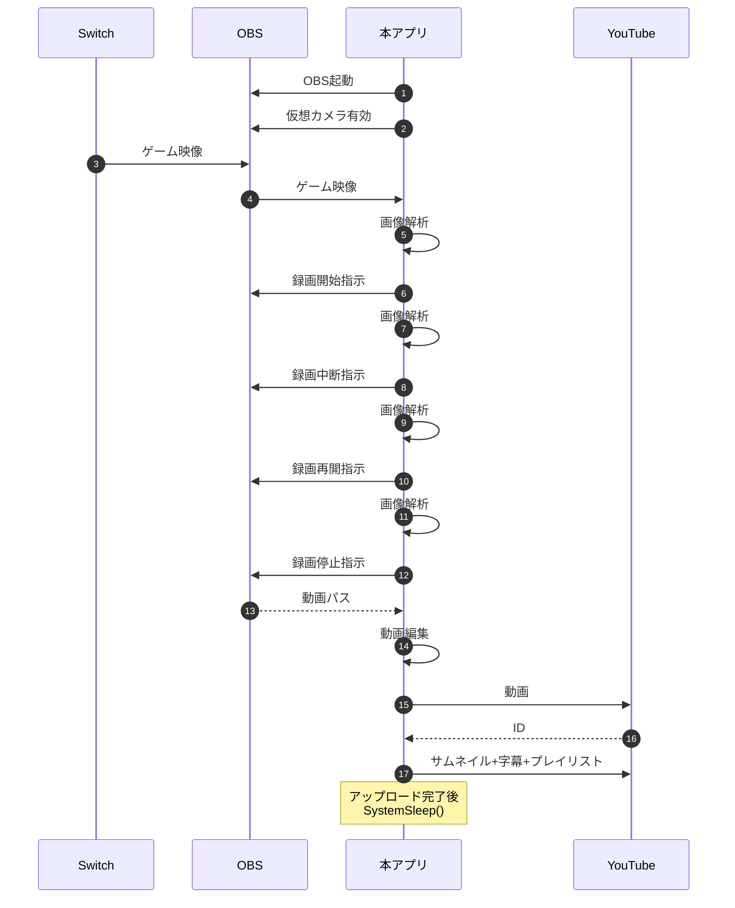
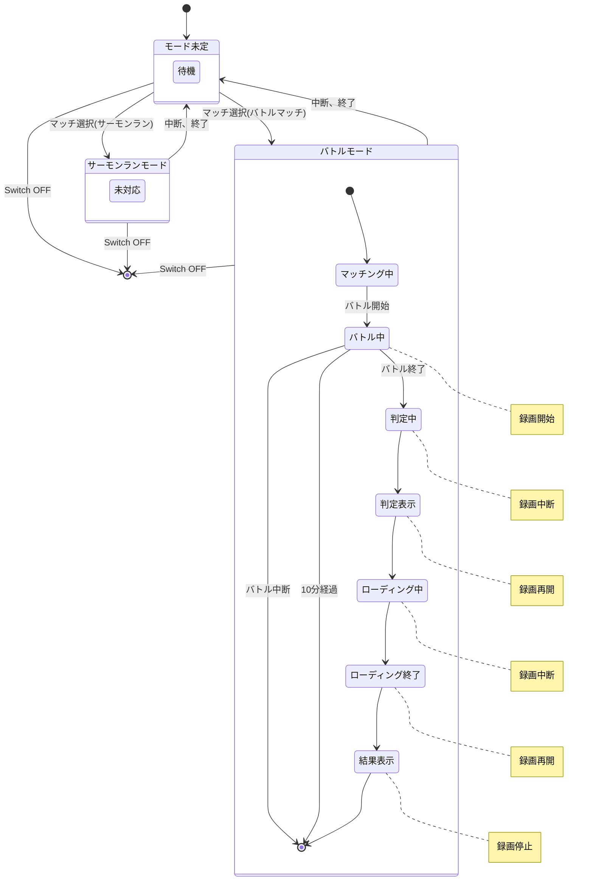
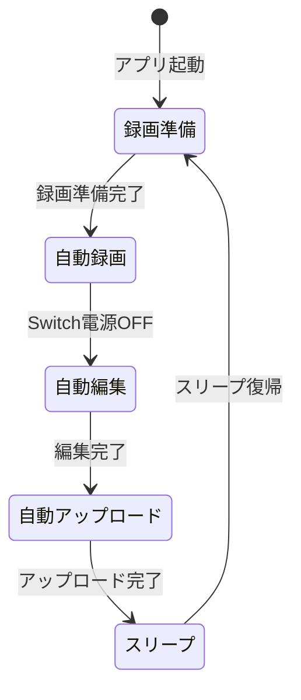
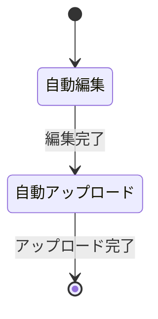

# Splat Replay - 外部設計書

## 1. 目的

スプラトゥーン 3 のプレイ動画をスマートフォンや PC を使って手軽に振り返り、プレイヤースキル向上に役立てる。
(スプラトゥーン 3 のメモリープレイヤー機能に依存せず、プレイヤーが手間なく試合の振り返りができる環境を提供する)

## 2. スコープ & 利用シーン

| 項目             | 内容                                       |
| ---------------- | ------------------------------------------ |
| 対象ユーザ       | 個人プレイヤー                             |
| 主なユースケース | ① プレイ後の自己分析 ②YouTube などへの共有 |
| 対応ゲーム       | スプラトゥーン 3 (Ver. 最新)               |
| 対応 OS          | Windows 11 64bit                           |
| 入出力           | HDMI / USB / YouTube API / Groq API        |

---

## 3. ハードウェア構成

---

## 4. ソフトウェア構成（論理アーキテクチャ）

### 4.1 使用技術・主要ミドルウェア

- **OBS Studio** 28 以降（仮想カメラ & 録画制御）
- **Python 3.13**（アプリ本体）
- **uv**（仮想環境管理）
- **FFmpeg**（動画編集 CLI）
- **Google YouTube Data API v3**（アップロード）
- **Groq API**（音声認識）
- **OpenCV**（映像解析）
- **Tesseract** (OCR)

## 4.2 処理フロー概要

---

## 5. 機能要件

### 5.1 録画準備

- キャプチャデバイスが接続されているかを確認し、接続されていない場合はユーザーに接続を促す。
- OBS が起動しているかを確認し、起動していない場合は起動する。
- OBS の仮想カメラが有効になっているかを確認し、無効な場合は有効にする。

### 5.2 自動録画

- **常時**
  - Switch の電源 OFF を監視し、電源 OFF を検出したら、自動録画機能を終了する。
- **待機**
  - マッチ選択画面でゲームモードがバトルかサーモンランかを判別する。

#### 5.2.1 バトルモード

- **マッチ選択**
  - マッチ選択画面でレートを取得し、メタデータに保存する。
    - X マッチの場合、X パワーを取得する。
      - X パワーは、 500.0 ～ 6000.0 の値とする。
    - バンカラマッチの場合、ウデマエを取得する。
      - ウデマエは、 `C-`・`C`・`C+`・`B-`・`B`・`B+`・`A-`・`A`・`A+`・`S`・`S+`のいずれかとする。
  - マッチングを検出したら、マッチング開始時間をメタデータに保存する。
- **マッチング中**
  - スケジュール変更を検出したら、メタデータをリセットする。
  - バトル開始を検出したら、録画・文字起こしを開始する。
- **バトル中**
  - 1 分以内はバトル中断を監視してバトル中断を検出したら、録画・文字起こしを停止し、メタデータをリセットする。
  - 10 分以上経過したら、録画・文字起こしを停止し、録画した動画ファイルと文字起こしした字幕ファイルを録画後フォルダに保存する。
  - バトル終了を検出したら、録画・文字起こしを中断する。
- **結果判定中**
  - 判定表示を検出したら、録画・文字起こしを再開し、判定結果をメタデータに保存する。
    - 判定結果は、`win`・`lose`のいずれかとする。
- **判定表示**
  - ロード画面を検出したら、録画・文字起こしを中断する。
- **ローディング中**
  - ロード画面終了を検出したら、録画・文字起こしを再開する。
- **ローディング終了**
  - 結果表示を検出したら、録画・文字起こしを停止する。
- **結果表示**
  - マッチ・ルール・ステージ・キルレコードを取得し、メタデータに保存する。録画した動画ファイルと文字起こしした字幕ファイルと結果表示の画像ファイルを録画後フォルダに保存する。
    - マッチは、`レギュラーマッチ`・`バンカラマッチ(オープン)`・`バンカラマッチ(チャレンジ)`・`Xマッチ`・`イベントマッチ`・`フェスマッチ(オープン)`・・`フェスマッチ(チャレンジ)`・`トリカラマッチ`のいずれかとする。
    - ルールは、`ナワバリバトル`・`ガチホコ`・`ガチエリア`・`ガチヤグラ`・`ガチアサリ`・`トリカラバトル`のいずれかとする。
    - ステージは、`ユノハナ大渓谷`・`ゴンズイ地区`・`ヤガラ市場`・`マテガイ放水路`・`ナメロウ金属`・`マヒマヒリゾート＆スパ`・`キンメダイ美術館`・`マサバ海峡大橋`・`海女美術大学`・`チョウザメ造船`・`ザトウマーケット`・`スメーシーワールド`・`ヒラメが丘団地`・`クサヤ温泉`・`ナンプラー遺跡`・`マンタマリア号`・`タラポートショッピングパーク`・`コンブトラック`・`タカアシ経済特区`・`オヒョウ海運`・`バイガイ亭`・`ネギトロ炭鉱`・`カジキ空港`・`リュウグウターミナル`・`デカライン高架下`のいずれかとする。
    - キルレコードは、キル数・デス数・スペシャル使用回数とする。

#### 5.2.2 サーモンランモード

現状、未対応

### 5.3 自動編集

- 動画ファイルを結合する。
  - バトルモードの場合、スケジュール・マッチ毎に結合する。
    - スケジュールは 1 時から 2 時間周期とする。
  - サーモンランモードの場合、ステージ毎に結合する。
- 結合する動画毎にタイトルを作成し、動画ファイルのメタデータのタイトルに埋め込む。
  - 設定のタイトルテンプレートに合わせてメタデータを付与する。
- 結合する動画毎に説明を作成し、動画ファイルのメタデータのコメントに埋め込む。
  - 設定の説明テンプレートに合わせてメタデータを付与する。
- 結合する動画と合わせて字幕も結合し、結合した動画ファイルに埋め込む。
- 結合する動画毎に設定の倍率で音量を調整する。
- 結合する動画毎にサムネイル画像を生成し、結合した動画ファイルに埋め込む。
  - サムネイル画像は結合する動画の結果表示画像の中から一番明度が高い画像を選定してサムネイル画像のベースとする。
  - サムネイル画像に勝敗数・マッチ・ルール・レート範囲・ステージ画像を記載する。
- 結合した動画ファイルを編集済フォルダに保存する。編集した動画ファイル・字幕ファイル・サムネイル画像を削除する。

### 5.3 自動アップロード

- 編集後の動画ファイルのメタデータからタイトルとコメント(説明)を抽出する。
- YouTube に編集後の動画ファイルをアップロードする。
  - タイトルと説明を含める。
  - 設定のタグを含める。
  - 設定の公開情報を含める。
- アップロードした動画に字幕を付与する。
- プレイリストが設定されている場合、アップロードした動画をプレイリストに追加する。

### 5.4 スリープ

- PC をスリープする。

## 6 非機能要件

- **使用感** : アプリ起動後、プレイ開始〜終了まで無操作。
- **パフォーマンス** : 1080p60 録画で各解析時間 < 1/60 s。

## 7 ユースケース

### 7.1 基本

基本的には、ユーザーがアプリを起動すると、自動で録画・編集・アップロードが実行される。

#### 7.1.1 手動操作

自動録画中、手動操作で録画の開始・中断・再開・停止ができること

### 7.2 アップロード

自動編集と自動アップロードのみを実行する。

## 8 設定

### 8.1 YouTube アップロード設定

- 公開範囲: `公開` / `限定` / `非公開`
- タイトルテンプレート: `{BATTLE}({RATE}) {RULE} {WIN}勝{LOSE}敗 {DAY} {SCHEDULE}時～`
- 説明欄テンプレート: `{CHAPTERS}`
- チャプターテンプレート: `{RESULT} {KILL}k {DEATH}d {SPECIAL}s  {STAGE}`
- タグ: 複数可 (例: `スプラトゥーン3`)
- プレイリスト ID: 任意のプレイリスト ID

### 8.2 動画編集設定

- 音量倍率: 数値 (例: `1.0`)

## 9 UI

### 9.1 CUI

- 基本ユースケースの全自動処理を実行できること
- アップロードユースケースの自動編集・アップロードを実行できること

### 9.2 GUI

基本ユースケースの全自動処理を実行すること

#### 9.2.1 メイン画面

- 録画準備できていない場合、ポップアップ表示すること
- 設定画面を起動できること
- ゲーム映像をプレビュー表示できること
- 録画状態が分かること
- 手動操作で録画を開始・中断・再開・停止できること
  - 録画停止中は録画開始ができること
  - 録画中は録画中断・停止ができること
  - 録画中断中は録画再開ができること
- 検出したメタデータ(レート・マッチング開始時間・判定結果・マッチ・ルール・ステージ・キルレコード)・字幕を表示し、手動編集できること
- 録画済の動画ファイル一覧を表示し、削除・アップロード除外・メタデータ編集・字幕編集ができること

#### 9.2.2 設定画面

- 設定変更できること

> **UX 指針** : 主要操作は 1〜2 クリック以内で完結し、リアルタイム反映されること。

---

> **備考** : 本仕様書は外部設計レベルまでを対象とし、アルゴリズムやコード詳細は別途内部設計書にて扱う。
