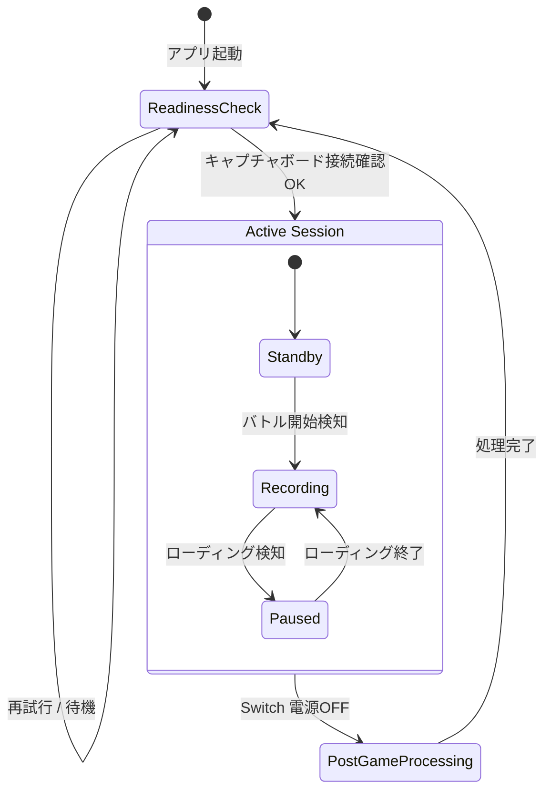
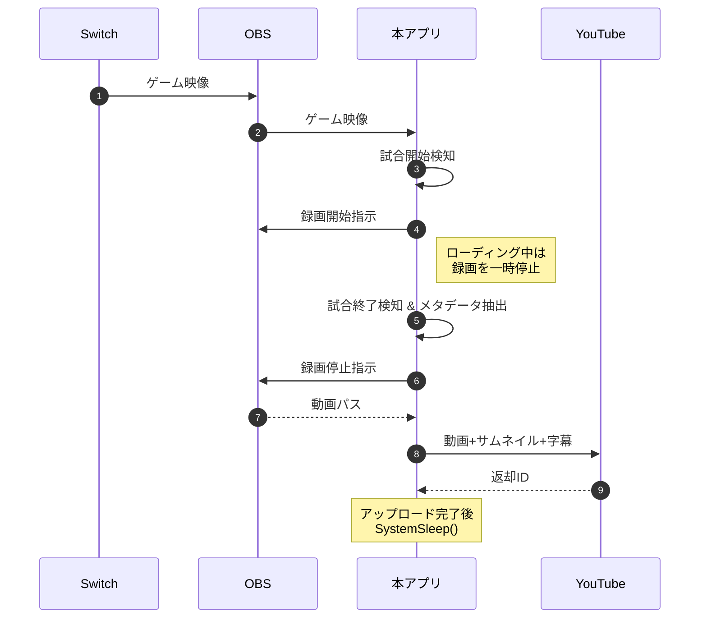

# Splat Replay - 外部設計書

## 1. 目的

スプラトゥーン 3 のプレイ動画をスマートフォンや PC を使って手軽に振り返り、プレイヤースキル向上に役立てる。
(スプラトゥーン 3 のメモリープレイヤー機能に依存せず、PC 上で録画・編集・アップロードを自動化することで、プレイヤーが手間なく試合の振り返りができる環境を提供する)

## 2. スコープ & 利用シーン

| 項目             | 内容                                                            |
| ---------------- | --------------------------------------------------------------- |
| 対象ユーザ       | 個人プレイヤー                                                  |
| 主なユースケース | ① プレイ後の自己分析 ②YouTube などへの共有 ③ 試合ハイライト作成 |
| 対応ゲーム       | スプラトゥーン 3 (Ver. 最新)                                    |
| 対応 OS          | Windows 11 64bit                                                |
| 入出力           | HDMI / USB / YouTube API / Groq API                             |

---

## 3. ハードウェア構成

---

## 4. ソフトウェア構成（論理アーキテクチャ）

### 4.1 使用技術・主要ミドルウェア

- **OBS Studio** 28 以降（仮想カメラ & 録画制御）
- **Python 3.13**（アプリ本体）
- **uv**（仮想環境管理）
- **FFmpeg**（動画編集 CLI）
- **Google YouTube Data API v3**（アップロード）
- **Groq API**（音声認識）
- **OpenCV**（映像解析）
- **Tesseract** (OCR)

---

## 5. 機能要件

### 5.1 自動録画

1. **バトル開始検知** : 画面解析でマッチ開始を検知し録画/文字起こしを開始。
2. **ローディング検知** : ローディング中は録画を一時停止、終了後に再開。
3. **メタデータ抽出** : ルール・ステージ・勝敗・キルレ・レートを画像/音声解析から取得。
4. **メタデータ埋込** : バトル終了直後に取得したメタデータを録画ファイルへ書き込む。
5. **字幕埋込** : 文字起こし結果を字幕トラックとして埋め込む。
6. **電源 OFF トリガ** : Switch 電源 OFF を検出したら自動編集/アップロードを実行。

### 5.2 自動編集

1. **動画結合** : マッチ毎に録画クリップを結合。
2. **メタデータ再埋込** : 結合後の動画にもメタデータを付与。
3. **サムネイル生成** : バトル結果画面をベースにサムネイルを生成。
4. **音量調整** : 設定された倍率で音量調整。

### 5.3 自動アップロード

1. YouTube への動画アップロード（公開 / 限定 / 非公開を選択可能）。
2. タイトル・説明文テンプレート置換（日時、ステージ名など）。
3. タグ設定（例: "Splatoon3", "スプラトゥーン 3"）。
4. サムネイル・字幕(SRT)を同時アップロード。
5. 任意のプレイリストへ自動追加。
6. アップロード完了後に PC をスリープ（自動起動設定により、復帰時は本アプリが自動再開）。

### 5.4 電源管理

- アップロード完了後、PC を スリープへ移行。
- 手動終了しない限り、ゲームプレイ録画待機ができるバックグラウンドアプリとして動作。

### 5.5 非機能要件

- **使用感** : アプリ起動後、プレイ開始〜終了まで無操作。
- **パフォーマンス** : 1080p60 録画で各解析時間 < 1/60 s。
- **保守性** : モジュール化されたスクリプト構成、pytest による単体テスト。

### 5.6 GUI 要件

| UI セクション            | 機能概要                                                                                   | 手動操作可否 |
| ------------------------ | ------------------------------------------------------------------------------------------ | ------------ |
| **設定**                 | 音量倍率・タイトルテンプレ・タグ・公開範囲などを編集・保存                                 | ✔            |
| **ゲーム映像プレビュー** | OBS 仮想カメラ映像をリアルタイム表示 (最大 1080p60)                                        | ―            |
| **録画ステータス**       | 現在の録画/停止/一時停止状態を表示し、ワンクリックで手動開始・停止                         | ✔            |
| **メタデータパネル**     | 抽出されたルール・ステージ・勝敗・レート等をフォーム表示しユーザーが修正可能               | ✔            |
| **録画データ一覧**       | 収録済みファイルのサムネイルと詳細を一覧。行ごとに「削除」「アップロード除外」トグルを提供 | ✔            |

> **UX 指針** : 主要操作は 1〜2 クリック以内で完結し、リアルタイム反映されること。

### 5.7 設定

#### 5.7.1 YouTube アップロード設定

- 公開範囲: `公開` / `限定` / `非公開`
- タイトルテンプレート: `{BATTLE}({RATE}) {RULE} {WIN}勝{LOSE}敗 {DAY} {SCHEDULE}時～`
- 説明欄テンプレート: `{CHAPTERS}`
- チャプターテンプレート: `{RESULT} {KILL}k {DEATH}d {SPECIAL}s  {STAGE}`
- タグ: 複数可 (例: `スプラトゥーン3`)
- プレイリスト ID: 任意のプレイリスト ID

#### 5.7.2 動画編集設定

- 音量倍率: 数値 (例: `1.0`)

## 6. 状態遷移図（録画ライフサイクル & 電源管理）（録画ライフサイクル & 電源管理）

## 6.1 ステート別検知・検出ロジック（Splatoon 3 ドメイン知識）

> 各ライフサイクル状態で実行する具体的な検知・検出処理を整理する。内部設計書の詳細フロー作成時のインプットとする。

### 常時

- **電源OFF監視** : いつでも Switch の電源OFF を監視し、検出時は編集・アップロード処理を実行。

### Standby

- **スケジュール変更検知** : スケジュール変更を検出したら、保持中のメタデータをリセットする。
- **レート取得** : マッチ選択を検出したら、その画面内に表示されているレートを OCR／画像解析しメタデータに保存。
- **マッチング開始検出** : マッチング開始を検出ししたら、その日時をメタデータに記録。
- **バトル開始監視** : マッチング中のみバトル開始を監視し、検出したら `Recording` へ遷移。

### Recording

- **早期中断監視 (⩽60 s)** : 開始 1 分以内はバトル中断を監視し、検出したら録画・文字起こしを停止して `Standby` へ戻る。
- **ローディング検出** : ローディング画面を検出したら録画・文字起こしを一時停止し `Paused` へ遷移。
  - ローディングは 2 パターンあるため、いずれかを検出したら `Paused` へ遷移する。ローディングを検出したパターンによってローディング終了の検出方法が異なる。
- **Finish 検出** : Finish 演出を検出したら録画を一時停止し `Paused` へ遷移。
- **時間超過終了 (≥10 分)** : バトル開始から 10 分経過したら録画を終了し編集待ちキューへ保存。
- **勝敗検出** : 勝敗を検出したら、メタデータに記録。
- **結果表示検出** : 勝敗検出後、リザルト画面を検出したら、録画・文字起こしを停止し、動画にメタデータ・字幕・サムネイルを埋め込んで編集キューへ追加。完了後 `Standby` へ遷移。

### Paused

- **ローディング終了検出** : ローディング終了を検出したら録画・文字起こしを再開し `Recording` へ遷移。
- **Finish 終了検出** : Finish 演出が終わったら録画を再開し `Recording` へ遷移。

---

## 7. 処理フロー（概要）

---

> **備考** : 本仕様書は外部設計レベルまでを対象とし、アルゴリズムやコード詳細は別途内部設計書にて扱う。
