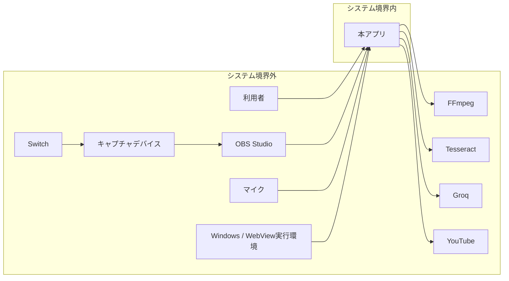
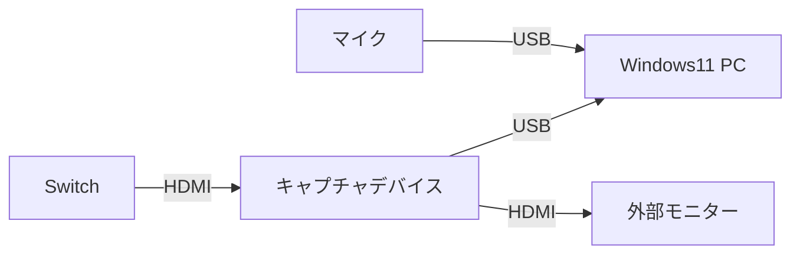
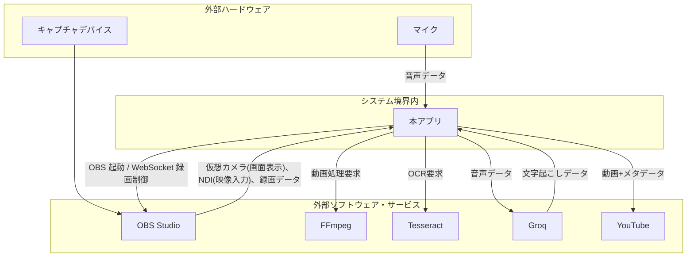
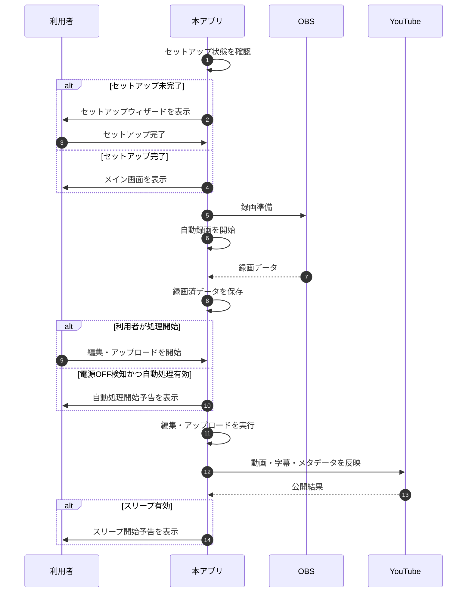
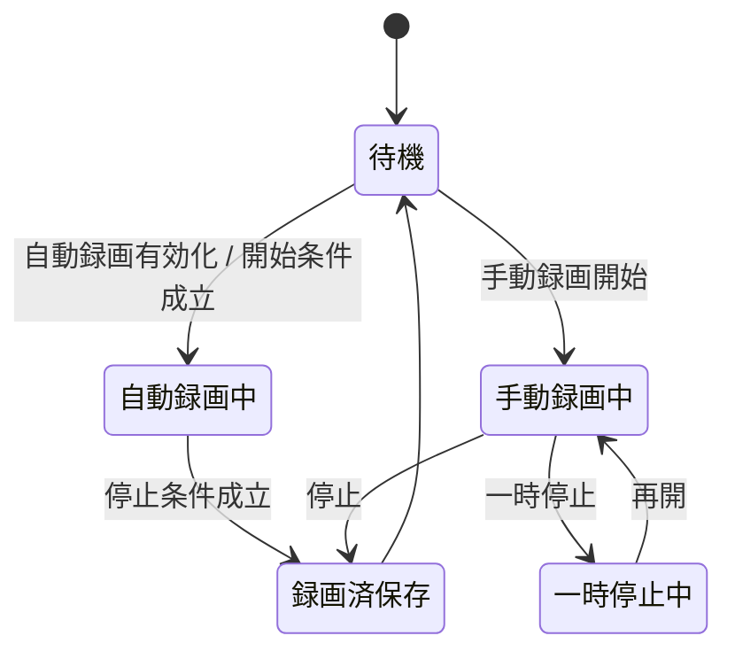
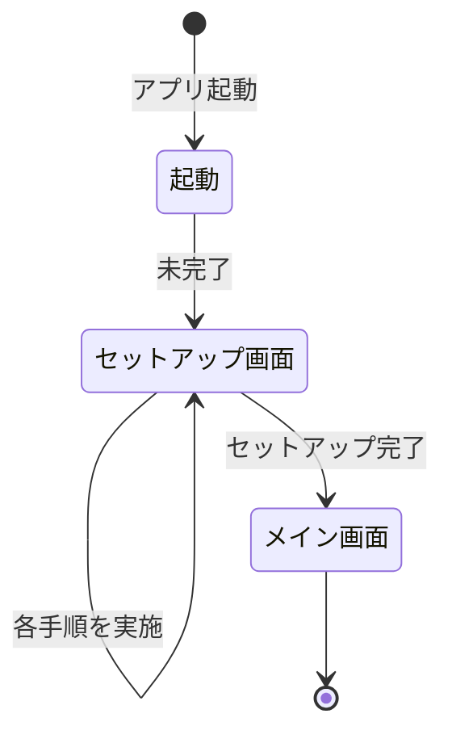
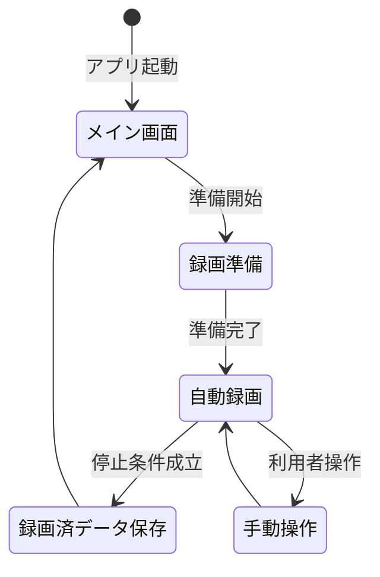
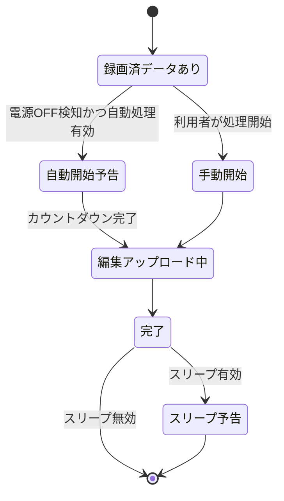

# Splat Replay - 外部設計書

## 1. 目的

Windows 11 PC 上でスプラトゥーン 3 のプレイ映像を録画・確認し、
必要に応じて編集・アップロードまで行える環境を提供する。

本アプリは、セットアップ、録画、メタデータ管理、編集、アップロードの導線を一体で提供し、
プレイヤーが試合の振り返りと共有を行いやすくすることを目的とする。

## 2. スコープ

| 項目         | 内容                                             |
| ------------ | ------------------------------------------------ |
| 対象ユーザ   | 個人プレイヤー                                   |
| 主な利用目的 | ① 録画と振り返り ② YouTube などへの共有          |
| 対応ゲーム   | スプラトゥーン 3                                 |
| 対応 OS      | Windows 11 64bit                                 |
| 主な外部連携 | HDMI / USB / OBS Studio / YouTube API / Groq API |

---

## 3. システム境界と責務分担

### 3.1 システム境界

外部設計上のシステム境界は `本アプリ` のみを内側とし、
利用者、ハードウェア、外部ソフトウェア、外部サービスはすべて境界の外側に置く。

```mermaid
graph LR
    subgraph Outside[システム境界外]
        User[利用者]
        Switch[Switch]
        CaptureDevice[キャプチャデバイス]
        Microphone[マイク]
        OBS[OBS Studio]
        FFmpeg[FFmpeg]
        Tesseract[Tesseract]
        Groq[Groq]
        YouTube[YouTube]
        Runtime[Windows / WebView実行環境]
    end
    subgraph Inside[システム境界内]
        App[本アプリ]
    end

    User --> App
    Switch --> CaptureDevice --> OBS --> App
    Microphone --> App
    Runtime --> App
    App --> FFmpeg
    App --> Tesseract
    App --> Groq
    App --> YouTube
```

- `GUI` や `Web API` は、本アプリが利用者へ提供する接点として扱う。
- `OBS Studio`、`FFmpeg`、`Tesseract`、`Groq`、`YouTube` は、本アプリが利用する外部要素として扱う。

### 3.2 主体別の責務

| 主体                      | 担う責務                                                                                       | 担わない責務                                               |
| ------------------------- | ---------------------------------------------------------------------------------------------- | ---------------------------------------------------------- |
| 利用者                    | 機材・認証情報の準備、初期設定、必要時の確認や修正                                             | 録画制御や外部連携の内部処理                               |
| 本アプリ                  | セットアップ案内、録画準備、録画制御、メタデータ管理、編集、アップロード、状態表示、エラー通知 | ゲーム映像生成、外部製品の内部仕様保証、外部障害の恒久解消 |
| Switch                    | ゲーム映像の出力                                                                               | 録画や保存の制御                                           |
| キャプチャデバイス        | 映像を PC へ入力可能な形で中継                                                                 | 録画状態やメタデータの管理                                 |
| マイク                    | 音声入力の提供                                                                                 | 文字起こしや字幕化                                         |
| OBS Studio                | 映像入力の取り込み、録画実行基盤の提供                                                         | 本アプリの業務判断、動画整理、アップロード                 |
| FFmpeg                    | 動画・音声の編集処理                                                                           | 編集対象の業務判断                                         |
| Tesseract / Groq          | OCR、文字起こしなどの専用処理                                                                  | 録画制御、保存、公開判断                                   |
| YouTube                   | 動画公開、字幕付与、プレイリスト管理の受け皿                                                   | ローカル動画編集、録画データ管理                           |
| Windows / WebView実行環境 | デスクトップ実行基盤の提供                                                                     | 業務機能の実行判断                                         |

### 3.3 本アプリが担わない責務

- ゲーム映像そのものの生成
- OBS や YouTube など外部製品の内部仕様保証
- 外部サービス障害や認証ポリシー変更の恒久解消

---

## 4. ハードウェア構成

```mermaid
graph LR
    Switch[Switch] -- HDMI --> CaptureDevice[キャプチャデバイス]
    CaptureDevice -- USB --> PC[Windows11 PC]
    Microphone[マイク] -- USB --> PC
    CaptureDevice -- HDMI --> Monitor[外部モニター]
```

---

## 5. 外部連携構成

```mermaid
graph TD
    subgraph 外部ハードウェア
        Microphone[マイク]
        CaptureDevice[キャプチャデバイス]
    end
    subgraph ExternalSoftwareServices["外部ソフトウェア・サービス"]
        OBS[OBS Studio]
        FFmpeg[FFmpeg]
        Tesseract[Tesseract]
        Groq[Groq]
        YouTube[YouTube]
    end
    subgraph システム境界内
        App[本アプリ]
    end

    CaptureDevice --> OBS
    App -- OBS 起動 / WebSocket 録画制御 --> OBS
    OBS -- 仮想カメラ(画面表示)、NDI(映像入力)、録画データ --> App
    Microphone -- 音声データ --> App
    App -- 動画処理要求 --> FFmpeg
    App -- OCR要求 --> Tesseract
    App -- 音声データ --> Groq
    Groq -- 文字起こしデータ --> App
    App -- 動画+メタデータ --> YouTube
```

### 5.1 使用技術・主要ミドルウェア

- **OBS Studio** 28 以降（仮想カメラ & WebSocket 録画制御）
- **Python 3.13**（アプリ本体）
- **uv**（仮想環境管理）
- **Node.js 24.12.0+**（フロントエンドビルド）
- **NDI 6 Runtime**（OBS からの映像取り込み）
- **FFmpeg**（動画編集 CLI）
- **Google YouTube Data API v3**（アップロード）
- **Groq API**（音声認識）
- **OpenCV**（映像解析）
- **Tesseract** (OCR)

### 5.2 処理フロー概要

```mermaid
sequenceDiagram
    autonumber
    participant User as 利用者
    participant App as 本アプリ
    participant OBS
    participant YT as YouTube
    App->>App: セットアップ状態を確認
    alt セットアップ未完了
        App->>User: セットアップウィザードを表示
        User->>App: セットアップ完了
    else セットアップ完了
        App->>User: メイン画面を表示
    end
    App->>OBS: 録画準備
    App->>App: 自動録画を開始
    OBS-->>App: 録画データ
    App->>App: 録画済データを保存
    alt 利用者が処理開始
        User->>App: 編集・アップロードを開始
    else 電源OFF検知かつ自動処理有効
        App->>User: 自動処理開始予告を表示
    end
    App->>App: 編集・アップロードを実行
    App->>YT: 動画・字幕・メタデータを反映
    YT-->>App: 公開結果
    alt スリープ有効
        App->>User: スリープ開始予告を表示
    end
```

---

## 6. 機能要件

### 6.1 起動と画面遷移

- 起動時にセットアップ完了状態を確認し、判定中はローディング画面を表示する。
- セットアップ未完了の場合はセットアップ画面を表示する。
- セットアップ完了の場合はメイン画面を表示する。
- Web GUI と WebView GUI は同一の画面構成で動作する。

### 6.2 セットアップ

- セットアップウィザードで以下の手順を順次実行できること。
  - ハードウェア確認
  - FFmpeg セットアップ
  - OBS セットアップ
  - Tesseract セットアップ
  - フォントインストール
  - 文字起こし設定
  - YouTube API 設定
- 各手順の完了状態またはスキップ状態を保持できること。
- すべての必要手順が完了した後にメイン画面へ遷移できること。

### 6.3 録画準備

- キャプチャデバイスの接続状態を確認し、未接続の場合は利用者へ案内を表示する。
- OBS の起動状態を確認し、未起動の場合は起動する。
- OBS の仮想カメラを有効化する。
- プレビュー入力種別を取得できること。
  - `live_capture`
  - `video_file`

### 6.4 録画制御

```mermaid
stateDiagram-v2
    [*] --> 待機
    待機 --> 自動録画中 : 自動録画有効化 / 開始条件成立
    待機 --> 手動録画中 : 手動録画開始
    自動録画中 --> 録画済保存 : 停止条件成立
    手動録画中 --> 一時停止中 : 一時停止
    一時停止中 --> 手動録画中 : 再開
    手動録画中 --> 録画済保存 : 停止
    録画済保存 --> 待機
```

- 自動録画の有効化・無効化ができること。
- 手動で録画の開始・一時停止・再開・停止ができること。
- 録画状態を取得し、GUI に表示できること。
- 最新プレビューフレームを取得し、GUI に表示できること。
- 録画中のリアルタイムメタデータを取得・更新できること。
- 録画停止後は、録画済データとして動画と関連メタデータを保存すること。
- サーモンランの自動録画は現状未対応とする。

### 6.5 編集・アップロード

- 録画済データ一覧と編集済データ一覧を表示できること。
- 録画済データに対して以下の操作ができること。
  - 動画再生
  - サムネイル拡大表示
  - メタデータ編集
  - 字幕編集
  - 削除
- 編集済データに対して以下の操作ができること。
  - 動画再生
  - サムネイル拡大表示
  - 削除
- メイン画面から編集・アップロード処理を手動開始できること。
- 初回の手動処理開始前に、YouTube 権限ダイアログを表示できること。
- `電源オフ後に編集開始する` が有効で、録画済データが存在する場合は、電源 OFF 検知後に自動処理開始予告を表示し、一定時間経過後に編集・アップロードを開始できること。
- 編集・アップロード処理中は進捗状態を取得・表示できること。
- 動画編集時に以下を実行できること。
  - 編集対象動画の結合
  - タイトル・説明・チャプターの生成
  - 字幕の結合
  - 音量調整
  - サムネイル生成
- アップロード時に以下を実行できること。
  - YouTube への動画アップロード
  - タイトル・説明・タグ・公開範囲の反映
  - 字幕の付与
  - プレイリスト追加
- 実行中の編集・アップロード処理に対して、今回の処理に限った `sleep_after_upload` の一時設定を更新できること。

### 6.6 設定

- GUI からアプリケーション設定を取得・更新できること。
- 設定は少なくとも以下のカテゴリを扱えること。
  - キャプチャデバイス
  - OBS 接続
  - 動画保存先
  - 動作設定
  - 文字起こし設定
  - 動画編集設定
  - YouTube アップロード設定
  - WebView 表示設定
- カメラ権限ダイアログおよび YouTube 権限ダイアログの表示済状態を保持できること。

### 6.7 スリープ

- `アップロード終了後にスリープする` が有効な場合、編集・アップロード完了後にスリープ開始予告を表示できること。
- スリープ開始予告はカウントダウン付きで表示し、利用者がキャンセルできること。
- 条件成立時に PC をスリープできること。

## 7. 非機能要件

- **使用感** : セットアップ完了後は 1 つのメイン画面で録画状態確認、録画制御、録画済データ確認、編集・アップロード開始、設定変更を行えること。
- **操作継続性** : 自動録画、自動処理開始予告、スリープ開始予告の状態を GUI 上で継続して確認できること。
- **暫定** : 性能目標の厳密な数値は本書では固定せず、詳細は別途性能評価で扱う。

## 8. ユースケース

### 8.1 初回セットアップ

初回起動時またはセットアップ未完了時に、利用者はセットアップウィザードを完了してメイン画面へ遷移する。

```mermaid
stateDiagram-v2
    [*] --> 起動 : アプリ起動
    起動 --> セットアップ画面 : 未完了
    セットアップ画面 --> セットアップ画面 : 各手順を実施
    セットアップ画面 --> メイン画面 : セットアップ完了
    メイン画面 --> [*]
```

### 8.2 通常録画

セットアップ完了後にメイン画面を開き、録画準備と自動録画を行いながら、必要に応じて手動録画操作やメタデータ修正を行う。

```mermaid
stateDiagram-v2
    [*] --> メイン画面 : アプリ起動
    メイン画面 --> 録画準備 : 準備開始
    録画準備 --> 自動録画 : 準備完了
    自動録画 --> 録画済データ保存 : 停止条件成立
    自動録画 --> 手動操作 : 利用者操作
    手動操作 --> 自動録画
    録画済データ保存 --> メイン画面
```

### 8.3 編集・アップロード

録画済データの確認後、利用者がメイン画面から処理開始するか、設定に応じて電源 OFF 検知後の自動処理を利用する。

```mermaid
stateDiagram-v2
    [*] --> 録画済データあり
    録画済データあり --> 手動開始 : 利用者が処理開始
    録画済データあり --> 自動開始予告 : 電源OFF検知かつ自動処理有効
    自動開始予告 --> 編集アップロード中 : カウントダウン完了
    手動開始 --> 編集アップロード中
    編集アップロード中 --> 完了
    完了 --> スリープ予告 : スリープ有効
    完了 --> [*] : スリープ無効
    スリープ予告 --> [*]
```

## 9. 設定

現行実装で扱う代表設定は以下のとおり。

| カテゴリ             | 代表項目                                                                                   |
| -------------------- | ------------------------------------------------------------------------------------------ |
| キャプチャデバイス   | キャプチャボード名                                                                         |
| OBS 接続             | WebSocket ホスト / ポート / パスワード / OBS 実行ファイルパス                              |
| 動画保存先           | 動画保存先フォルダ                                                                         |
| 動作                 | `電源オフ後に編集開始する` / `アップロード終了後にスリープする` / `対戦履歴を累積記録する` |
| 文字起こし           | 有効 / 無効、マイクデバイス、Groq API キー、音声認識モデル、言語                           |
| 動画編集             | 音量倍率、タイトルテンプレート、説明テンプレート、チャプターテンプレート、字幕読み上げ設定 |
| YouTube アップロード | 公開範囲、タグ、プレイリスト ID、キャプション名                                            |
| 表示                 | WebView 描画モード                                                                         |

### 9.1 テンプレート設定例

- タイトルテンプレート: `{BATTLE}({RATE}) {RULE} {WIN}勝{LOSE}敗 {DAY} {SCHEDULE}時～`
- 説明欄テンプレート: `{CHAPTERS}`
- チャプターテンプレート: `{RESULT} {KILL}k {DEATH}d {SPECIAL}s  {STAGE}`

## 10. UI

### 10.1 CUI

- `auto` コマンドで録画から編集・アップロードまでの全自動処理を実行できること。
- `upload` コマンドで編集・アップロード処理を実行できること。
- `web` コマンドで Web GUI を起動できること。
- `webview` コマンドで pywebview ベースのデスクトップ GUI を起動できること。

### 10.2 GUI

GUI はセットアップ画面とメイン画面の 2 画面で構成する。

#### 10.2.1 セットアップ画面

- セットアップウィザードを表示できること。
- 現在のセットアップ手順に応じた画面を切り替えられること。
- 手順の進行状況を保持し、完了後にメイン画面へ遷移できること。

#### 10.2.2 メイン画面

- 設定画面を起動できること。
- ゲーム映像をプレビュー表示できること。
- 録画状態を表示できること。
- 手動で録画開始・一時停止・再開・停止ができること。
- リアルタイムメタデータを表示し、更新できること。
- 録画済データ一覧を表示し、動画再生、サムネイル拡大、メタデータ編集、字幕編集、削除ができること。
- 編集済データ一覧を表示し、動画再生、サムネイル拡大、削除ができること。
- 編集・アップロード処理の開始ボタンを表示できること。
- 編集・アップロード処理の進捗ダイアログを表示できること。
- 自動処理開始予告およびスリープ開始予告を通知できること。
- 設定ダイアログで設定変更できること。

> **UX 指針** : 主要操作は 1〜2 クリック以内で完結し、リアルタイム反映されること。

---

> **備考** : 本仕様書は外部設計レベルまでを対象とし、アルゴリズムやコード詳細は別途内部設計書にて扱う。
