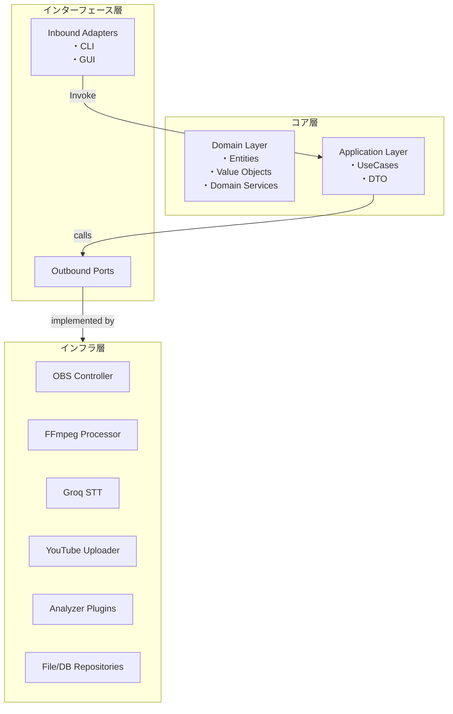

# Splat Replay - 内部設計書

## 1. 採用アーキテクチャ

### 1.1 アーキテクチャ選定

- **Clean Architecture (Ports & Adapters)** を採用します。

  - **保守性 / テスト容易性** : ドメイン層を純粋な Python オブジェクトで構成し、外部依存をポート越しに隔離。
  - **再利用性 / 拡張性** : アダプタを差し替えるだけで他プラットフォーム（例: Salmon Run）や外部 API 変更へ追従可能。
  - **CLI & GUI** : インバウンドポートとして CLI / GUI の 2 つのアダプタを実装するだけで同じユースケースを共有。
  - **動画解析の独立性** : 解析サービスをアウトバウンドポート化し、異なる解析エンジン(OpenCV 版・ML 版 etc.)をプラグイン追加。

### 1.2 レイヤ構成



## 2. パッケージ構成

```
backend/
├─ src/splat_replay/
│  ├─ domain/                     # ドメイン層（ビジネスロジック）
│  │  ├─ config/                  # ドメイン設定
│  │  ├─ models/                  # エンティティ・値オブジェクト
│  │  ├─ services/                # ドメインサービス
│  │  └─ ports/                   # ドメインポート
│  ├─ application/                # アプリケーション層（ユースケース）
│  │  ├─ interfaces/              # ポート定義
│  │  ├─ services/                # アプリケーションサービス
│  │  └─ use_cases/               # ユースケース実装
│  ├─ infrastructure/             # インフラ層（外部技術）
│  │  ├─ adapters/                # 外部システムアダプタ
│  │  ├─ repositories/            # データ永続化
│  │  ├─ matchers/                # 画像マッチング
│  │  ├─ messaging/               # イベントバス
│  │  └─ di/                      # 依存性注入
│  └─ interface/                  # インターフェース層（UI）
│     ├─ cli/                     # CLI
│     ├─ gui/                     # GUI（WebView）
│     └─ web/                     # Web API（FastAPI）
├─ config/                        # 設定ファイル
└─ assets/                        # リソースファイル

frontend/                         # フロントエンド（Svelte）
├─ src/
│  ├─ common/                     # 共通コンポーネント
│  ├─ main/                       # メインアプリUI
│  └─ setup/                      # セットアップウィザード
```

## 3. ドメインモデル詳細

### 3.1 主要エンティティ

| Entity                | 説明                                                                       |
| --------------------- | -------------------------------------------------------------------------- |
| **RecordingMetadata** | 1 試合分のメタデータ集約（マッチ種別、ルール、ステージ、勝敗、キルデス等） |
| **VideoAsset**        | 録画ファイルとメタデータのまとまり                                         |
| **GameMode**          | ゲームモード（BATTLE, SALMON_RUN）                                         |
| **Match/Rule/Stage**  | バトル情報の値オブジェクト                                                 |
| **Judgement/Rate**    | 勝敗・レート情報                                                           |
| **SetupState**        | セットアップ状態管理                                                       |

### 3.2 状態遷移

外部設計書の状態遷移図に対応：

- **Standby**: バトル開始待機 → フレーム解析でイベント検知
- **Recording**: バトル録画中 → メタデータ収集
- **Paused**: ローディング中 → 録画一時停止
- **PostGameProcessing**: 編集・アップロード処理

### 3.3 イベント駆動アーキテクチャ

システム全体でイベント駆動設計を採用：

**主要イベント**:

- 録画状態変更（`RECORDER_STATE`）
- メタデータ更新（`RECORDER_METADATA_UPDATED`）
- アセット操作（`ASSET_RECORDED_SAVED`, `ASSET_RECORDED_DELETED`）
- 編集・アップロード進捗（`EDITOR_PROGRESS`, `UPLOADER_PROGRESS`）

**SSE 統合**:

- フロントエンドへのリアルタイム通知
- `/api/events/*` エンドポイントでイベントストリーム配信

## 4. ポート設計

### 4.1 ポート配置の原則

**ドメイン層**: ビジネスロジックが必要とする外部機能の抽象定義
**アプリケーション層**: ユースケースが必要とするインフラ機能の抽象定義

### 4.2 主要ポート

**Inbound Ports（ユースケース）**:

- AutoRecordingUseCase
- EditUploadUseCase
- SetupUseCase

**Outbound Ports（外部システム抽象化）**:

- RecorderPort: 録画開始・停止・一時停止
- CapturePort: フレーム取得
- FrameAnalyzerPort: 画像解析
- VideoAssetRepositoryPort: アセット永続化
- EventPublisher: イベント発行

依存性逆転により、ドメイン・アプリケーション層は外部技術に依存しない。

## 5. ユースケースフロー

### 5.1 自動録画ユースケース

1. **初期化**: OBS 接続、キャプチャ起動、フレーム解析準備
2. **監視ループ**: フレーム取得 → 解析 → ステートマシン更新 → イベント処理
3. **録画開始/停止**: イベントに応じて録画制御
4. **録画保存**: メタデータ抽出、字幕生成、リポジトリ保存

### 5.2 編集・アップロードユースケース

1. **編集**: 録画ファイルをスケジュール単位でグルーピング・結合、サムネイル生成
2. **アップロード**: YouTube API 経由でアップロード、進捗通知
3. **完了処理**: ファイル整理、システムスリープ（オプション）

### 5.3 非機能要件

- **パフォーマンス**: 1080p60 録画で各解析 < 1/60 秒
- **使用感**: プレイ開始〜終了まで無操作
- **リアルタイム性**: SSE による即座の UI 更新

## 6. リポジトリアーキテクチャ

Clean Architecture の原則に従い、リポジトリ実装を責務ごとに分離：

- **FileVideoAssetRepository**: ポートインターフェースのファサード
- **RecordedAssetRepository**: 録画アセットの CRUD、イベント発行
- **EditedAssetRepository**: 編集済みアセットの CRUD、イベント発行
- **AssetFileOperations**: ファイル名生成、メタデータ読み書き
- **AssetEventPublisher**: アセット操作イベントの発行

リポジトリ操作時に自動的にイベント発行し、フロントエンドが SSE でリアルタイム受信・UI 更新。

## 7. フレーム解析アーキテクチャ

画像認識による画面状態判定の仕組み：

### 7.1 マッチャーの種類

目的に応じた複数のマッチング手法を提供：

- **TemplateMatcher**: テンプレート画像との部分一致検出
- **HSVMatcher**: 色域マスクによる色判定
- **UniformColorMatcher**: 色相の均一性判定
- **RGBMatcher**: RGB 値での厳密一致
- **HashMatcher**: ハッシュ値による完全一致
- **CompositeMatcher**: 複数マッチャーの論理結合（AND/OR/NOT）

### 7.2 設定管理

`config/image_matching.yaml`でマッチャーパラメータ（閾値、検索範囲、テンプレート等）を定義。
ゲーム画面変更時に設定調整で対応可能。

### 7.3 選択指針

- 精度重視: TemplateMatcher
- 色判定: HSVMatcher / RGBMatcher
- 単色判定: UniformColorMatcher
- 高速完全一致: HashMatcher

## 8. 設定管理・DI

### 8.1 設定管理

- **Pydantic BaseModel**による型安全な設定定義（`domain/config/`）
- **設定ファイル**: `config/settings.toml` (TOML 形式)
- **画像マッチング設定**: `config/image_matching.yaml` (YAML 形式)

### 8.2 依存性注入

- **DI コンテナ** (`infrastructure/di.py`): 設定・アダプタ・サービス・ユースケースの登録
- **注入パターン**: 各コンポーネントは設定オブジェクトを引数で受け取る（直接読み込み禁止）
- **レイヤ分離**: 各モジュール (`di/adapters.py`, `di/services.py`, `di/use_cases.py`)

### 8.3 利点

- 型安全な設定バリデーション
- テスト容易性（モック差し替え）
- 環境別設定の切り替え
- レイヤ間依存の明確化

## 9. テスト戦略

### 9.1 テストピラミッド

Clean Architecture の各層に応じたテスト戦略：

- **ドメイン層**: 単体テスト（外部依存なし）
- **アプリケーション層**: ユースケーステスト（モック使用）
- **インフラ層**: 結合テスト（実外部システム連携）

テストデータは `tests/fixtures/` で管理。

## 10. ロギング & エラー処理

### 10.1 ロギング

- **structlog**による構造化ログ
- 出力先: コンソール（開発）、ファイル（`backend/logs/splat-replay.log`、日次ローテーション）
- GUI: WebSocket 経由でフロントエンドへログストリーム配信

### 10.2 エラー処理

- **ドメイン例外** (`domain/exceptions/`): `DomainException`, `InvalidStateTransition`, `InvalidMetadata`
- **アプリケーション例外**: `UseCaseException`, `ResourceNotFound`
- **インフラ例外**: 外部エラーのラップ・リトライロジック

## 11. 拡張ポイント

将来の機能拡張に対応する設計：

### 11.1 ポート実装の追加

- **新 STT エンジン**: `SpeechToTextPort`実装を追加
- **新アップロード先**: `VideoUploaderPort`実装を追加
- **新ストレージ**: `AssetStoragePort`実装を追加

### 11.2 解析手法の追加

- **ML/AI 解析**: `infrastructure/matchers/ml/`に新マッチャー実装
- **OCR 変更**: `OCRPort`実装を差し替え

### 11.3 UI 拡張

- **モバイル**: `interface/mobile/`に新レイヤ追加
- **Web**: フロントエンドにコンポーネント追加

### 11.4 拡張時の注意点

- 既存ポートインターフェースを維持（新ポート追加）
- 後方互換性の保持
- イベント駆動での実装（既存コードへの影響最小化）

## 12. API 設計

FastAPI による REST API + Server-Sent Events (SSE) で構成：

### 12.1 API 構成

- **セットアップ API**: システム要件チェック、デバイス設定、認証
- **録画 API**: 録画制御（開始/停止/一時停止）、状態管理
- **アセット API**: 録画・編集済み動画の管理、配信
- **メタデータ API**: 試合情報の CRUD
- **設定 API**: アプリケーション設定管理
- **イベント API (SSE)**: リアルタイム状態通知

### 12.2 実装

- **Base URL**: `http://127.0.0.1:8000`
- **ドキュメント**: `/docs` (Swagger UI)
- **実装**: `backend/src/splat_replay/interface/web/routers/`

詳細なエンドポイント仕様は Swagger UI で確認可能。

## 13. GUI 設計

WebView（pywebview + FastAPI + Svelte）ベースのデスクトップアプリ：

- **設定ボタン** (最上部)
- **映像プレビュー & メタデータパネル** (中央)
- **録画ステータスバー** (下部)
- **録画データ一覧** (最下部)

詳細は `frontend/` および `backend/src/splat_replay/interface/web/` 参照。
