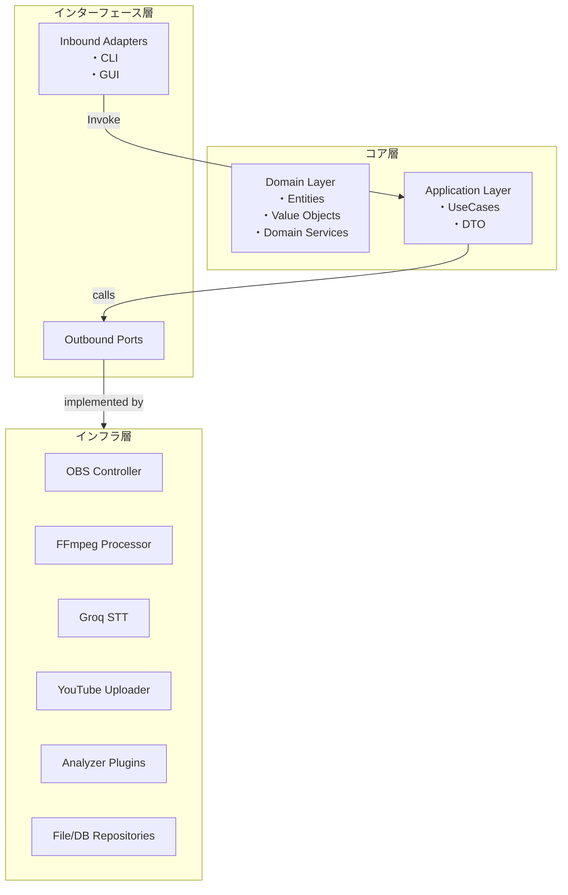
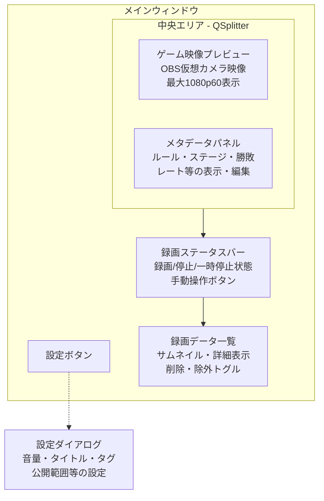

# Splat Replay - 内部設計書

## 1. 採用アーキテクチャ

### 1.1 アーキテクチャ選定

- **Clean Architecture (Ports & Adapters)** を採用します。

  - **保守性 / テスト容易性** : ドメイン層を純粋な Python オブジェクトで構成し、外部依存をポート越しに隔離。
  - **再利用性 / 拡張性** : アダプタを差し替えるだけで他プラットフォーム（例: Salmon Run）や外部 API 変更へ追従可能。
  - **CLI & GUI** : インバウンドポートとして CLI / GUI の 2 つのアダプタを実装するだけで同じユースケースを共有。
  - **動画解析の独立性** : 解析サービスをアウトバウンドポート化し、異なる解析エンジン(OpenCV 版・ML 版 etc.)をプラグイン追加。

### 1.2 レイヤ構成



## 2. パッケージ構成

```
src/
├─ domain/
│  ├─ models/
│  │  ├─ match.py
│  │  ├─ rule.py
│  │  ├─ stage.py
│  │  ├─ result.py
│  │  ├─ edit_config.py
│  │  ├─ upload_config.py
│  │  └─ video_clip.py
│  ├─ services/
│  │  └─ state_machine.py
├─ application/
│  ├─ use_cases/
│  │  ├─ record_battle.py
│  │  ├─ process_postgame.py
│  │  ├─ upload_video.py
│  │  └─ shutdown_pc.py
│  └─ interfaces.py
├─ infrastructure/
│  ├─ adapters/
│  │  ├─ obs_controller.py
│  │  ├─ ffmpeg_processor.py
│  │  ├─ groq_client.py
│  │  ├─ youtube_client.py
│  │  └─ system_power.py
│  ├─ analyzers/
│  │  ├─ splatoon_battle_analyzer.py
│  │  ├─ splatoon_salmon_analyzer.py
│  │  └─ common/
│  │     ├─ image_utils.py
│  │     └─ ocr.py
│  └─ repositories/
├─ ui/
│  ├─ cli/
│  │  └─ main.py
│  └─ gui/
│     ├─ app.py
│     └─ widgets/
│        ├─ preview_widget.py
│        ├─ status_bar.py
│        ├─ metadata_panel.py
│        ├─ recording_table.py
│        └─ settings_dialog.py
├─ config/
│  ├─ settings.example.toml
│  ├─ settings.toml
│  └─ image_matching.yaml
└─ shared/
   ├─ config.py
   ├─ di.py
   └─ logger.py
```

## 3. ドメインモデル詳細

| Entity    | 属性                                                          | 説明                 |
| --------- | ------------------------------------------------------------- | -------------------- |
| **Match** | id, rate, start_at, rule, stage, result, kill, death, special | 1 試合分のメタデータ |

### 3.1 外部設計書ステート対応

#### 3.1.1 状態遷移図との対応

外部設計書の状態遷移図に合わせたドメインモデル設計：

- **ReadinessCheck**: システム初期化・接続確認状態
- **ActiveSession**: ゲームプレイ監視状態
  - **Standby**: バトル開始待機
  - **Recording**: バトル録画中
  - **Paused**: ローディング中（録画一時停止）
- **PostGameProcessing**: Switch 電源 OFF 後の編集・アップロード処理

#### 3.1.2 検知・検出ロジック対応

各ステートで実行する具体的な処理：

| ステート  | 検知内容                                                 | ドメインイベント                                                                        |
| --------- | -------------------------------------------------------- | --------------------------------------------------------------------------------------- |
| Standby   | スケジュール変更・レート取得・マッチング開始・バトル開始 | `ScheduleChanged`, `RateDetected`, `MatchingStarted`, `BattleStarted`                   |
| Recording | 早期中断・ローディング・Finish・勝敗・結果表示           | `EarlyAbort`, `LoadingDetected`, `FinishDetected`, `ResultDetected`, `PostGameDetected` |
| Paused    | ローディング終了・Finish 終了                            | `LoadingFinished`, `FinishFinished`                                                     |

## 4. ポート設計

### 4.1 InboundPort

```python
class RecordBattleInputPort(Protocol):
    def execute(self) -> None: ...
```

### 4.2 OutboundPort

```python
class VideoRecorder(Protocol):
    def start(self) -> None: ...
    def stop(self) -> Path: ...
```

(略)

## 5. ユースケースフロー

### 5.1 外部設計書処理フロー対応

外部設計書のシーケンス図に対応したユースケース実装：

1. **RecordBattle** → VideoRecorder.start() → StateMachine

   - Switch からの映像を OBS 経由で取得
   - バトル開始検知で録画開始指示
   - ローディング検知で録画一時停止

2. **ProcessPostGame** → VideoRecorder.stop() → FFmpeg ジョブ

   - バトル終了検知で録画停止
   - メタデータ抽出・字幕生成
   - 動画編集キューへ追加

3. **UploadVideo** → YouTubeClient.upload() → PC スリープ
   - 動画・サムネイル・字幕を YouTube へアップロード
   - アップロード完了後に SystemSleep() 実行

### 5.2 非機能要件対応

- **パフォーマンス**: 1080p60 録画で各解析時間 < 1/60 s
- **使用感**: プレイ開始〜終了まで無操作
- **保守性**: モジュール化されたスクリプト構成

## 6. アナライザプラグイン

プラグイン方式で Battle/Salmon 両対応。

### 6.1 モード別メタデータの吸収

バトルとサーモンランでは取得すべき情報や判定基準が異なるため、
各プラグインは `BattleMetadata` / `SalmonMetadata` といった専用 DTO を返す。
アプリケーション層では `GameResult` 抽象クラスを通して扱うことで、
ユースケース側の処理を共通化する。

編集処理についても、
動画のグルーピングやタイトル生成ルールをモードごとにクラス化する。
`VideoEditor` は `GameResult` の実装型に応じて適切な戦略を選択する。
この仕組みにより将来的な仕様変更時も影響範囲を最小化できる。

## 7. 画像判定（マッチング開始等）ノウハウ

### 7.1 概要

Splatoon の画面解析において、バトル開始・終了・ステージ識別等の画像判定技術が必要です。
目的に応じて最適なマッチング手法を選択し、パフォーマンスと精度のバランスを調整します。

### 7.2 マッチング手法一覧

#### 7.2.1 HashMatcher（ハッシュマッチング）

**アプローチ**：

- 画像全体をバイト列として SHA-1 ハッシュを算出し、比較する

**特徴**：

- 完全一致のみ検出
- 非常に高速（≈0.004 秒）

**注意点**：

- 画像の微小な変化やリサイズでハッシュ値が変わる
- 厳密な一致用途に限られる

#### 7.2.2 HSVMatcher（HSV カラーマスク）

**アプローチ**：

- BGR→HSV 変換
- `cv2.inRange(lower, upper)`で色域マスクを生成
- マスク領域内の画素比率を計算し、閾値以上ならマッチと判定

**特徴**：

- 任意の色域に対して柔軟に対応
- マスク（ROI）指定可
- 中速（≈0.013 秒）

**パラメータ**：

- `lower_bound`, `upper_bound`（HSV 各チャネルの範囲を表す 3 要素タプル）
- `threshold`（色域画素比率の閾値）

#### 7.2.3 UniformColorMatcher（均一色判定）

**アプローチ**：

- BGR→HSV 変換
- 色相チャネルの標準偏差を計算
- `std_hue ≤ hue_threshold`なら「同系色」と判定

**特徴**：

- 画像全体（またはマスク領域）の色相バラつきの少なさを判定
- 同系色（グラデーションや単色背景など）判定に有効
- 中速（≈0.013 秒）

**パラメータ**：

- `hue_threshold`（許容する色相の標準偏差）

#### 7.2.4 RGBMatcher（ピクセル単位 RGB 完全一致）

**アプローチ**：

- マスク適用後、各画素の RGB 値を指定値と比較
- マッチ画素の割合を計算し、閾値以上ならマッチと判定

**特徴**：

- ピクセル単位の厳密一致
- マスク領域指定可
- 比較的遅め（≈0.05 秒）

**パラメータ**：

- `rgb`（比較する RGB 値を表す 3 要素タプル）
- `threshold`（マッチ比率の閾値）

#### 7.2.5 TemplateMatcher（テンプレートマッチング）

**アプローチ**：

- BGR→ グレースケール変換
- OpenCV `cv2.matchTemplate`（TM_CCOEFF_NORMED）でスコア算出
- 最大スコアが閾値以上ならマッチ

**特徴**：

- 部分一致検索が可能
- 位置情報（x, y）も取得可
- やや重い（≈0.07 秒）

**パラメータ**：

- `template_path`（検索用テンプレート）
- `threshold`（一致スコアの閾値）

### 7.3 選択指針

| 目的                     | 推奨手法                | 理由                             |
| ------------------------ | ----------------------- | -------------------------------- |
| 精度重視・部分検出       | TemplateMatcher         | 部分一致検索と位置情報取得が可能 |
| 色調の大まかな一致       | HSVMatcher / RGBMatcher | 色域指定による柔軟な判定         |
| 単色・グラデーション判定 | UniformColorMatcher     | 色相の均一性を効率的に判定       |
| 完全一致のみ             | HashMatcher             | 最高速度での厳密一致             |

### 7.4 実装上の考慮点

#### 7.4.1 パフォーマンス最適化

- **速度要件に合わせた手法選択**：リアルタイム処理では軽量な手法を優先
- **マスク（ROI）活用**：不要な領域を除外してノイズ削減・処理速度向上
- **段階的判定**：高速な手法で粗選別 → 詳細な手法で精密判定

#### 7.4.2 設定管理

各マッチャーのパラメータは外部設定ファイルで管理し、ゲームアップデートによる画面変更に対応：

```yaml
# config/image_matching.yaml
simple_matchers:
  battle_start_template:
    type: "template"
    template_path: "templates/battle_start.png"
    threshold: 0.85

  ink_color_detection:
    type: "hsv"
    lower_bound: [100, 150, 150]
    upper_bound: [120, 255, 255]
    threshold: 0.7

composite_detection:
  battle_start:
    and:
      - matcher: battle_start_template
      - not:
          matcher: ink_color_detection
```

## 8. 設定管理・DI

### 8.1 設定管理アーキテクチャ

設定の管理は以下の方針で統一します：

#### 8.1.1 設定管理モジュール (`shared/config.py`)

- **Pydantic BaseSettings** によるタイプセーフなバリデーション
- **環境変数・設定ファイル・デフォルト値** の優先順位管理
- **設定変更の集中管理** と依存関係チェック
- **GUI からの設定更新** にも対応

```python
# 設定クラス例
class AppSettings(BaseSettings):
    youtube: YouTubeSettings = YouTubeSettings()
    video_edit: VideoEditSettings = VideoEditSettings()
    obs: OBSSettings = OBSSettings()
    image_matching: ImageMatchingSettings = ImageMatchingSettings()

    class Config:
        env_file = ".env"
```

#### 8.1.2 設定注入パターン

各モジュールは設定を直接読み込まず、DI コンテナ経由で注入される設定オブジェクトを使用：

```python
# ❌ 直接読み込み（アンチパターン）
class YouTubeClient:
    def __init__(self):
        self.config = load_config("config/settings.toml")

# ✅ DI による注入（推奨パターン）
class YouTubeClient:
    def __init__(self, settings: YouTubeSettings):
        self.settings = settings
```

#### 8.1.3 設定変更の反映

- **GUI 設定変更**: `SaveSettingsUseCase` → 設定ファイル更新 → アプリケーション再起動不要
- **ホットリロード**: 一部設定（YouTube タイトルテンプレート等）は即座に反映
- **要再起動設定**: OBS 接続設定等は次回起動時に反映

### 8.2 依存性注入

- **punq** コンテナによる DI 実装
- **設定オブジェクト** を各サービスに注入
- 実装時の差し替え容易性を確保

```python
# DI コンテナ設定例
def configure_container() -> punq.Container:
    container = punq.Container()

    # 設定の登録
    settings = AppSettings()
    container.register(AppSettings, instance=settings)
    container.register(YouTubeSettings, instance=settings.youtube)

    # サービスの登録
    container.register(YouTubeClient, YouTubeClient)
    container.register(RecordBattleUseCase, RecordBattleUseCase)

    return container
```

### 8.3 設定項目詳細

#### 8.3.1 YouTube アップロード設定

```python
class YouTubeSettings(BaseSettings):
    visibility: Literal["public", "unlisted", "private"] = "private"
    title_template: str = "{MATCH}({RATE}) {RULE} {WIN}勝{LOSE}敗 {DAY} {SCHEDULE}時～"
    description_template: str = "{CHAPTERS}"
    chapter_template: str = "{RESULT} {KILL}k {DEATH}d {SPECIAL}s  {STAGE}"
    tags: List[str] = ["スプラトゥーン3"]
    playlist_id: Optional[str] = None
```

**各変数の説明：**

- `{MATCH}`：マッチ名称(レギュラーマッチ、X マッチ等)
- `{RATE}`：レート（X パワー や ウデマエ等）
- `{RULE}`：ルール名（ナワバリ、ガチエリア等）
- `{WIN}`：勝利数
- `{LOSE}`：敗北数
- `{DAY}`：プレイ日
- `{SCHEDULE}`：プレイ開始時刻
- `{CHAPTERS}`：チャプター情報を挿入
- `{RESULT}`：勝敗結果
- `{KILL}`：キル数
- `{DEATH}`：デス数
- `{SPECIAL}`：スペシャル使用回数
- `{STAGE}`：ステージ名

```python
class ImageMatchingSettings(BaseSettings):
    matchers: Dict[str, MatcherConfig]

    class MatcherConfig(BaseModel):
        type: Literal["template", "hsv", "rgb", "hash", "uniform"]
        threshold: float = Field(ge=0.0, le=1.0)
        template_path: Optional[str] = None
        lower_bound: Optional[Tuple[int, int, int]] = None
        upper_bound: Optional[Tuple[int, int, int]] = None
        rgb: Optional[Tuple[int, int, int]] = None
        hue_threshold: Optional[float] = None
```

#### 8.3.3 設定ファイル優先順位

1. **環境変数** (`YOUTUBE_VISIBILITY=public`)
2. **設定ファイル** (`config/settings.toml`)
3. **デフォルト値** (コード内定義)

#### 8.3.4 設定ファイル形式

`config/settings.example.toml` を `config/settings.toml` としてコピーして利用する:

```toml
[youtube]
visibility = "private"
title_template = "{MATCH}({RATE}) {RULE} {WIN}勝{LOSE}敗 {DAY} {SCHEDULE}時～"
tags = ["スプラトゥーン3"]

[video_edit]
volume_multiplier = 1.2

[obs]
websocket_host = "localhost"
websocket_port = 4455
```

### 8.4 設定管理の利点

| 利点                   | 詳細                                                   |
| ---------------------- | ------------------------------------------------------ |
| **タイプセーフティ**   | Pydantic による実行時型チェック・バリデーション        |
| **集中管理**           | 全設定を `shared/config.py` で一元管理                 |
| **テスト容易性**       | モックオブジェクトによる設定値の差し替えが簡単         |
| **環境別設定**         | 開発・本番環境で異なる設定ファイル・環境変数を使い分け |
| **設定変更の影響範囲** | 設定変更時の依存関係を明確化、意図しない副作用を防止   |
| **GUI 連携**           | 設定ダイアログからの変更を型安全に処理                 |

## 9. テスト戦略

ドメイン=ユニット, アプリケーション=シナリオ, インフラ=結合。

## 10. ロギング & エラー処理

ロギングは `shared/logger.py` で `initialize_logger()` を呼び出して設定し、
各モジュールでは `get_logger()` を利用してログ出力を行います。
アプリケーション層だけでなくドメイン層やインフラ層も同じロガーを取得します。
`structlog` を用いた JSON 形式の出力に統一します。GUI ではログ内容を専用パネル
へ転送して表示できるようにします。

## 11. 拡張ポイント

| 目的            | 追加箇所                                            |
| --------------- | --------------------------------------------------- |
| Salmon Run 解析 | `infrastructure.analyzers.splatoon_salmon_analyzer` |
| 新 STT エンジン | `SpeechToText` 実装を追加                           |

---

## 12. GUI 設計

### 12.1 メインウィンドウレイアウト



- **最上部**: 設定ボタン
- **中央 (QSplitter)**: 左に _ゲーム映像プレビュー_、右に _メタデータパネル_
- **下部**: _録画ステータスバー_ （録画状態表示と手動操作）
- **最下部**: _録画データ一覧_ （収録済みファイルの管理）

### 12.2 ウィジェット詳細

| Widget                 | クラス                                     | 概要                                                                                                                                   |
| ---------------------- | ------------------------------------------ | -------------------------------------------------------------------------------------------------------------------------------------- |
| **GamePreviewWidget**  | `widgets.preview_widget.GamePreviewWidget` | OBS 仮想カメラのフレームを QOpenGLWidget で表示。最大 1080p60 対応。リアルタイム映像プレビュー。                                       |
| **RecordingStatusBar** | `widgets.status_bar.RecordingStatusBar`    | `QStatusBar` 拡張。録画/停止/一時停止状態インジケータ + ワンクリック手動操作ボタン。                                                   |
| **MetadataPanel**      | `widgets.metadata_panel.MetadataPanel`     | `QFormLayout` でルール・ステージ・勝敗・レート等を表示。ユーザー修正可能なフォーム UI。編集時 `UpdateMetadataUseCase` 発行。           |
| **RecordingTable**     | `widgets.recording_table.RecordingTable`   | `QTableView` + `RecordingTableModel`。収録済みファイルのサムネイル・詳細を一覧表示。行ごとに「削除」「アップロード除外」トグルを提供。 |
| **SettingsDialog**     | `widgets.settings_dialog.SettingsDialog`   | `QDialog`。音量倍率・タイトルテンプレート・タグ・公開範囲等の設定。閉じると `SaveSettingsUseCase` 発行。                               |

#### 12.2.1 外部設計書 GUI 要件との対応

| 外部設計書要件       | 実装ウィジェット   | 手動操作 | 備考                                   |
| -------------------- | ------------------ | -------- | -------------------------------------- |
| ゲーム映像プレビュー | GamePreviewWidget  | ―        | 最大 1080p60、リアルタイム表示         |
| 録画ステータス       | RecordingStatusBar | ✔        | ワンクリック手動開始・停止             |
| メタデータパネル     | MetadataPanel      | ✔        | ルール・ステージ等の表示・修正         |
| 録画データ一覧       | RecordingTable     | ✔        | サムネイル表示、削除・除外トグル       |
| 設定                 | SettingsDialog     | ✔        | 音量・タイトル・タグ・公開範囲等の編集 |

#### 12.2.2 UX 指針の実装

- **1〜2 クリック以内での操作完結**: 全ての主要操作をボタン・トグルで直接実行
- **リアルタイム反映**: Qt のシグナル・スロットによる即座な UI 更新
- **手動操作可否**: 外部設計書で ✔ の項目は全て手動操作に対応
