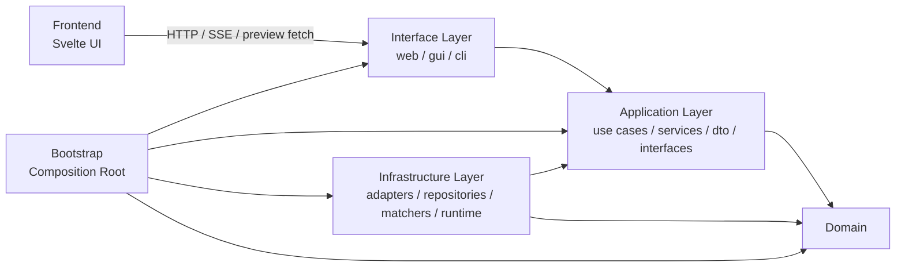

# Splat Replay - 内部設計書

## 0. この文書の責務

この文書は、Splat Replay の現行実装における内部構造を説明する
reference です。主に、レイヤ構成、主要ブロックの責務、依存方向、
代表的な実行時シナリオ、設定・DI・イベントなどの横断関心を扱います。

この文書で扱う内容:

- backend / frontend の主要構造
- 各レイヤ・主要ディレクトリの責務
- 依存方向と Composition Root
- 代表的な実行時フロー
- 設定・イベント・ログなどの横断関心

この文書で詳述しない内容:

- 利用者視点の仕様、画面要件、システム境界
- 開発環境構築、起動方法、日常開発コマンド
- 実装時の禁止事項や細かな Do / Don't
- テスト選定の詳細なルール
- 未実装の将来構想を現行実装として断定する説明

## 0.1 関連文書との分担

| 文書 | 主に扱うこと | この文書から見た位置付け |
| --- | --- | --- |
| `docs/external_spec.md` | 利用者視点の仕様、システム境界、外部連携、非機能要件 | 外から見える振る舞いの主文書 |
| `AGENTS.md` | repo 全体に常時適用する原則 | 実装時の always-on ルール |
| `backend/src/splat_replay/*/AGENTS.md` | 各層を変更するときの責務、禁止事項、実装パターン | 層ごとの変更ルール |
| `frontend/AGENTS.md` | frontend 固有の実装ルール | frontend 変更時のルール |
| `docs/DEVELOPMENT.md` | 開発環境構築、起動方法、日常開発フロー | how-to の主文書 |
| `docs/test_strategy.md` | テスト選定と完了条件 | テスト運用の SSOT |

補足:

- 本書は「現在どう組まれているか」を説明します。
- `AGENTS.md` 群は「変更するときに何を守るか」を説明します。

## 1. 採用アーキテクチャ

### 1.1 方針

- backend は Clean Architecture を前提に、`domain` / `application` /
  `interface` / `infrastructure` を分離します。
- `bootstrap` は Composition Root と起動エントリポイントを担い、
  DI とランタイム初期化を一箇所に集約します。
- frontend は Svelte + Vite の Web UI で、main 画面と setup 画面を
  同一 backend の API 群に接続します。
- frontend と backend の主な通信は、HTTP API、SSE、プレビュー取得 API
  です。現行実装では、UI 通知の主経路は WebSocket ではありません。

### 1.2 依存方向

```mermaid
graph LR
    Frontend[Frontend<br/>Svelte UI] -->|HTTP / SSE / preview fetch| Interface

    Bootstrap[Bootstrap<br/>Composition Root]
    Bootstrap --> Interface
    Bootstrap --> Application
    Bootstrap --> Infrastructure
    Bootstrap --> Domain

    Interface[Interface Layer<br/>web / gui / cli] --> Application
    Application[Application Layer<br/>use cases / services / dto / interfaces] --> Domain
    Infrastructure[Infrastructure Layer<br/>adapters / repositories / matchers / runtime] --> Application
    Infrastructure --> Domain
```

### 1.3 この構成を採る理由

- ドメインルールを外部技術から切り離し、変更点を局所化しやすくするため
- OBS、FFmpeg、OCR、アップロード先などの外部連携を差し替えやすくするため
- Web API、pywebview、CLI から同じユースケースを利用できるようにするため
- 画像解析、録画、編集、アップロードの責務境界を明確に保つため

## 2. 現在の構造

以下は現行コードで重要なディレクトリだけを抜粋したものです。
完全な一覧ではなく、責務のある単位を優先して記載します。

### 2.1 backend

| パス | 主な責務 |
| --- | --- |
| `backend/src/splat_replay/bootstrap/` | FastAPI / CLI / WebView の起動入口、Composition Root |
| `backend/src/splat_replay/domain/config/` | 型付き設定モデル |
| `backend/src/splat_replay/domain/models/` | 値オブジェクト、状態モデル、列挙型 |
| `backend/src/splat_replay/domain/events/` | ドメインイベント定義 |
| `backend/src/splat_replay/domain/ports/` | ドメインサービスが必要とする抽象 |
| `backend/src/splat_replay/domain/repositories/` | ドメイン側リポジトリ抽象 |
| `backend/src/splat_replay/domain/services/` | ステートマシン、解析器などの中核ロジック |
| `backend/src/splat_replay/application/dto/` | ユースケース境界の DTO |
| `backend/src/splat_replay/application/events/` | application から見たイベント種別定義 |
| `backend/src/splat_replay/application/interfaces/` | application 層が必要とするポート |
| `backend/src/splat_replay/application/services/` | 録画、設定、編集、アップロードなどの業務フロー部品 |
| `backend/src/splat_replay/application/use_cases/` | 自動録画、編集アップロード、一覧取得などのユースケース |
| `backend/src/splat_replay/interface/web/` | FastAPI ルーター、schema、converter、app factory |
| `backend/src/splat_replay/interface/gui/` | pywebview ランタイム統合 |
| `backend/src/splat_replay/interface/cli/` | CLI 入口 |
| `backend/src/splat_replay/infrastructure/adapters/` | OBS、FFmpeg、OCR、音声、upload、system などの具象実装 |
| `backend/src/splat_replay/infrastructure/repositories/` | 動画資産と sidecar の永続化 |
| `backend/src/splat_replay/infrastructure/matchers/` | 画像マッチャー実装と registry |
| `backend/src/splat_replay/infrastructure/messaging/` | `EventBus`、`CommandBus`、`FrameHub` |
| `backend/src/splat_replay/infrastructure/di/` | DI 登録の分割モジュール |
| `backend/src/splat_replay/infrastructure/runtime/` | アプリ内ランタイムのホスト |
| `backend/src/splat_replay/infrastructure/config/` | 設定ロード / 保存 |
| `backend/src/splat_replay/infrastructure/logging/` | structlog 初期化 |

### 2.2 frontend

| パス | 主な責務 |
| --- | --- |
| `frontend/src/common/` | 共通コンポーネント、共通型 |
| `frontend/src/main/` | メイン画面 UI、API 呼び出し、SSE 購読、録画プレビュー |
| `frontend/src/setup/` | セットアップ画面 UI、状態管理 |
| `frontend/src/themes/` | テーマ定義 |

### 2.3 実行時ファイル

- `config/settings.toml`
  - アプリ設定の保存先
- `config/image_matching.yaml`
  - 画像マッチング設定の保存先
- `videos/`, `outputs/`, `logs/`
  - 録画・編集結果・ログの保存先

通常開発時、これらは backend 側の runtime root 配下に作成されます。

## 3. レイヤ責務と AGENTS.md との違い

### 3.1 レイヤ責務

| 層 | 主な責務 | 含めないもの |
| --- | --- | --- |
| `domain` | ビジネスルール、状態モデル、ドメインイベント、解析の核 | UI、永続化、外部 API 呼び出し |
| `application` | ユースケース、業務フローの調停、ポート定義、DTO | フレームワーク依存、具象 I/O |
| `interface` | HTTP / GUI / CLI の入口、DTO 変換、エラーの境界変換 | ドメインロジック、外部連携の具象実装 |
| `infrastructure` | ポート実装、ファイル I/O、OBS / FFmpeg / OCR / upload / 設定ロード | ユースケースの意思決定そのもの |
| `bootstrap` | DI、依存解決、起動順序の組み立て | 業務ロジック本体 |
| `frontend` | UI 表示、入力、backend API / SSE との接続 | backend の業務判断 |

### 3.2 `AGENTS.md` との役割の違い

- 本書:
  - 現在の構造、責務境界、主要フローを説明する
- ルート `AGENTS.md`:
  - repo 全体の原則、文書の置き場所、完了前の最低ルールを定義する
- 各層の `AGENTS.md`:
  - その層を変更するときの禁止事項、実装パターン、チェックリストを定義する

言い換えると、本書は「構造の参照」、`AGENTS.md` は「変更時の運用ルール」です。

## 4. 主要ドメインモデル

ここでは現行コード上で意味の大きいモデルだけを記載します。
厳密な分類はコードを正とし、本書では概念境界を優先します。

| モデル | 主な役割 |
| --- | --- |
| `RecordingMetadata` | 1 録画セッション分のメタデータを表す不変モデル |
| `VideoAsset` | 動画、字幕、サムネイル、メタデータを束ねる不変モデル |
| `SetupState` | セットアップの進行状態と各種ダイアログ状態を持つ不変モデル |
| `GameMode`, `Match`, `Rule`, `Stage`, `Judgement`, `Rate`, `Result` | 試合情報を構成する値オブジェクト / 列挙型 |
| `StateMachine`, `RecordState` | 自動録画の状態遷移を表現する核 |

補足:

- `RecordingMetadata` と `VideoAsset` は、現行コードでは
  `@dataclass(frozen=True)` を用いた immutable な Value Object として
  実装されています。

## 5. 代表的な実行時シナリオ

### 5.1 自動録画

1. `bootstrap.web_app.create_app()` が DI コンテナを構成し、
   `WebAPIServer` を組み立てます。
2. `interface/web/routers/recording.py` が `/api/recorder/*` を受け取り、
   `AutoRecordingUseCase` や `AutoRecorder` に委譲します。
3. `AutoRecordingUseCase` はセットアップ後、
   `FrameCaptureProducer` と `PublisherWorker` を起動します。
4. メインループでは、フレーム取得、状態判定、ハンドラーによる
   `RecordingCommand` 生成、録画セッション制御を繰り返します。
5. 録画結果は repository 群で保存され、イベントバス経由で UI 更新へ伝播します。

### 5.2 編集・アップロード

1. `interface/web/routers/assets.py` が
   `/api/process/edit-upload` を受け取り、
   `StartEditUploadUseCase` を起動します。
2. `StartEditUploadUseCase` は重複実行を防ぎつつ、
   編集とアップロードをバックグラウンドで開始します。
3. `AutoEditor` が編集済み動画、サムネイル、関連 metadata を生成します。
4. `AutoUploader` が `UploadPort` 実装を通してアップロードし、
   進捗イベントを発行します。
5. 完了時は結果イベントを発行し、設定に応じて自動スリープ待機へ進みます。

### 5.3 フロントエンド通知とプレビュー

1. frontend は `/api/events/domain-events` と
   `/api/events/progress` を `EventSource` で購読します。
2. `frontend/src/main/domainEvents.ts` が受信イベントを UI 通知用メッセージへ変換します。
3. プレビューは入力種別で動作が分かれます。
4. `live_capture` ではブラウザの `getUserMedia()` で
   OBS Virtual Camera を取得して表示します。
5. `video_file` では `/api/recorder/preview-frame` をポーリングし、
   JPEG フレームとして表示します。

## 6. 横断関心事

### 6.1 設定管理

- 設定モデルは `domain/config/` にあり、`AppSettings` が全体を束ねます。
- 実ファイルの読み書きは `infrastructure/config/loaders.py` が担当します。
- 現行の主な保存先は `config/settings.toml` と
  `config/image_matching.yaml` です。
- 設定 UI 用の field metadata も backend 側で生成します。

### 6.2 DI とランタイム

- `infrastructure.di.configure_container()` が
  cross-cutting concerns、config、adapter、service、use case を登録します。
- `bootstrap/web_app.py` が DI から `WebAPIServer` を組み立てます。
- `interface/web/app_factory.py` が FastAPI app、lifespan、router 登録を担当します。
- `AppRuntime` は `EventBus`、`FrameHub`、`CommandBus` を保持し、
  非同期ランタイムの基盤になります。

### 6.3 イベントと通知

- application 層のイベント種別は `application/events/types.py` にあります。
- 現行イベント名は `asset.recorded.saved` のような
  ドット区切りの文字列です。
- Web UI 向けのリアルタイム通知は、現行実装では SSE が主経路です。
- progress と domain event は別ストリームで配信します。

### 6.4 ロギングとエラー処理

- ログは `structlog` を使用し、コンソールと JSON ログファイルへ出力します。
- ログファイルは runtime root 配下の `logs/` に日次ローテーションで保存します。
- interface 層は例外を HTTP エラーやレスポンスへ変換し、
  backend 内部では構造化ログへ記録します。
- 現行実装では、frontend への専用ログストリーム配信は確認できません。

### 6.5 テストとの関係

- テスト選定の詳細は `docs/test_strategy.md` を正とします。
- 本書では、どの境界を守る必要があるかだけを意識します。
  - レイヤ依存
  - API 契約
  - 主要 workflow
  - 性能影響点

## 7. 拡張方針

- 新しい外部連携を追加する場合:
  - まず適切なポートを `domain/ports/` または
    `application/interfaces/` に置く
  - 具象実装を `infrastructure/adapters/` に追加する
  - DI 登録を `infrastructure/di/` に追加する
- 新しい画像マッチャーを追加する場合:
  - `infrastructure/matchers/` に実装する
  - registry と設定読み込み経路を更新する
- UI を拡張する場合:
  - 共通 UI は `frontend/src/common/`
  - main 画面は `frontend/src/main/`
  - setup 画面は `frontend/src/setup/`
- 将来案を書く場合は、現行実装と混同しないよう
  `案` や `未実装` と明記します。

## 8. 関連文書

- `docs/external_spec.md`
- `docs/DEVELOPMENT.md`
- `docs/test_strategy.md`
- `AGENTS.md`
- `backend/src/splat_replay/domain/AGENTS.md`
- `backend/src/splat_replay/application/AGENTS.md`
- `backend/src/splat_replay/interface/AGENTS.md`
- `backend/src/splat_replay/infrastructure/AGENTS.md`
- `frontend/AGENTS.md`
