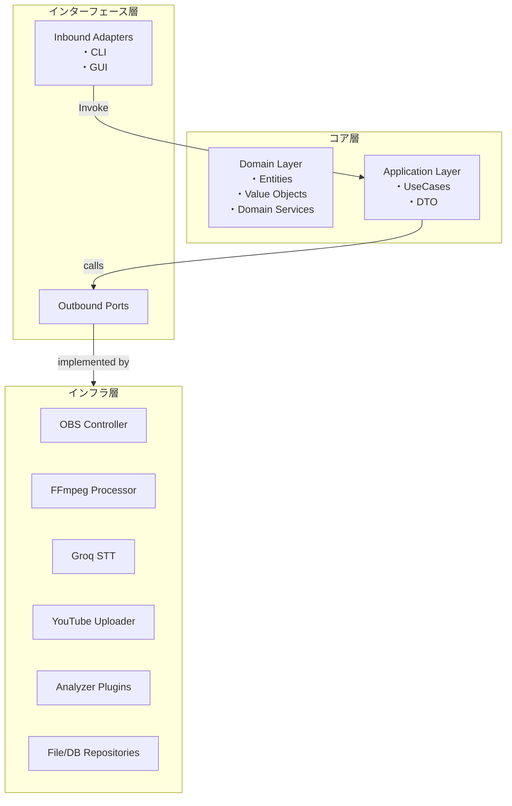
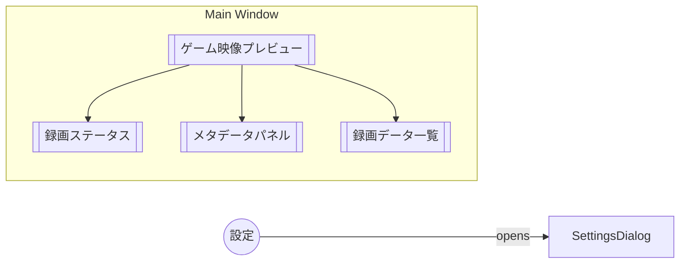

# Splat Replay - 内部設計書

## 1. 採用アーキテクチャ

### 1.1 アーキテクチャ選定

- **Clean Architecture (Ports & Adapters)** を採用します。

  - **保守性 / テスト容易性** : ドメイン層を純粋な Python オブジェクトで構成し、外部依存をポート越しに隔離。
  - **再利用性 / 拡張性** : アダプタを差し替えるだけで他プラットフォーム（例: Salmon Run）や外部 API 変更へ追従可能。
  - **CLI & GUI** : インバウンドポートとして CLI / GUI の 2 つのアダプタを実装するだけで同じユースケースを共有。
  - **動画解析の独立性** : 解析サービスをアウトバウンドポート化し、異なる解析エンジン(OpenCV 版・ML 版 etc.)をプラグイン追加。

### 1.2 レイヤ構成



## 2. パッケージ構成

```
src/
├─ domain/
│  ├─ models/
│  │  ├─ match.py
│  │  ├─ rule.py
│  │  ├─ stage.py
│  │  ├─ metadata.py
│  │  └─ video_clip.py
│  ├─ services/
│  │  └─ state_machine.py
│  └─ repositories/
│     └─ metadata_repo.py
├─ application/
│  ├─ use_cases/
│  │  ├─ record_battle.py
│  │  ├─ process_postgame.py
│  │  ├─ upload_video.py
│  │  └─ shutdown_pc.py
│  ├─ dto/
│  │  └─ video_summary.py
│  └─ interfaces.py
├─ infrastructure/
│  ├─ adapters/
│  │  ├─ obs_controller.py
│  │  ├─ ffmpeg_processor.py
│  │  ├─ groq_client.py
│  │  ├─ youtube_client.py
│  │  └─ system_power.py
│  ├─ analyzers/
│  │  ├─ splatoon_battle_analyzer.py
│  │  ├─ splatoon_salmon_analyzer.py
│  │  └─ common/
│  │     ├─ image_utils.py
│  │     └─ ocr.py
│  └─ repositories/
│     └─ file_metadata_repo.py
├─ ui/
│  ├─ cli/
│  │  └─ main.py
│  └─ gui/
│     ├─ app.py
│     └─ widgets/
│        ├─ preview_widget.py
│        ├─ status_bar.py
│        ├─ metadata_panel.py
│        ├─ recording_table.py
│        └─ settings_dialog.py
├─ config/
└─ shared/
   ├─ di.py
   └─ logger.py
```

## 3. ドメインモデル詳細

| Entity        | 属性                                 | 説明               |
| ------------- | ------------------------------------ | ------------------ |
| **Match**     | id, rule, stage, start_at, end_at    | バトル単位の主キー |
| **Metadata**  | kills, deaths, special, rate, result | 統計値             |
| **VideoClip** | path, duration, match_id             | 録画ファイル       |
| **Schedule**  | rule, stage, from, to                | スケジュール範囲   |

## 4. ポート設計

### 4.1 InboundPort

```python
class RecordBattleInputPort(Protocol):
    def execute(self) -> None: ...
```

### 4.2 OutboundPort

```python
class VideoRecorder(Protocol):
    def start(self) -> None: ...
    def stop(self) -> Path: ...
```

(略)

## 5. ユースケースフロー

1. **RecordBattle** → VideoRecorder.start() → StateMachine
2. **ProcessPostGame** → VideoRecorder.stop() → FFmpeg ジョブ
3. **UploadVideo** → YouTubeClient.upload() → PC スリープ

## 6. アナライザプラグイン

プラグイン方式で Battle/Salmon 両対応。

## 7. 画像判定（マッチング開始等）ノウハウ

### 7.1 概要

Splatoon の画面解析において、バトル開始・終了・ステージ識別等の画像判定技術が必要です。
目的に応じて最適なマッチング手法を選択し、パフォーマンスと精度のバランスを調整します。

### 7.2 マッチング手法一覧

#### 7.2.1 HashMatcher（ハッシュマッチング）

**アプローチ**：

- 画像全体をバイト列として SHA-1 ハッシュを算出し、比較する

**特徴**：

- 完全一致のみ検出
- 非常に高速（≈0.004 秒）

**注意点**：

- 画像の微小な変化やリサイズでハッシュ値が変わる
- 厳密な一致用途に限られる

#### 7.2.2 HSVMatcher（HSV カラーマスク）

**アプローチ**：

- BGR→HSV 変換
- `cv2.inRange(lower, upper)`で色域マスクを生成
- マスク領域内の画素比率を計算し、閾値以上ならマッチと判定

**特徴**：

- 任意の色域に対して柔軟に対応
- マスク（ROI）指定可
- 中速（≈0.013 秒）

**パラメータ**：

- `lower_bound`, `upper_bound`（HSV 各チャネルの範囲）
- `threshold`（色域画素比率の閾値）

#### 7.2.3 UniformColorMatcher（均一色判定）

**アプローチ**：

- BGR→HSV 変換
- 色相チャネルの標準偏差を計算
- `std_hue ≤ hue_threshold`なら「同系色」と判定

**特徴**：

- 画像全体（またはマスク領域）の色相バラつきの少なさを判定
- 同系色（グラデーションや単色背景など）判定に有効
- 中速（≈0.013 秒）

**パラメータ**：

- `hue_threshold`（許容する色相の標準偏差）

#### 7.2.4 RGBMatcher（ピクセル単位 RGB 完全一致）

**アプローチ**：

- マスク適用後、各画素の RGB 値を指定値と比較
- マッチ画素の割合を計算し、閾値以上ならマッチと判定

**特徴**：

- ピクセル単位の厳密一致
- マスク領域指定可
- 比較的遅め（≈0.05 秒）

**パラメータ**：

- `rgb`（比較する RGB 値）
- `threshold`（マッチ比率の閾値）

#### 7.2.5 TemplateMatcher（テンプレートマッチング）

**アプローチ**：

- BGR→ グレースケール変換
- OpenCV `cv2.matchTemplate`（TM_CCOEFF_NORMED）でスコア算出
- 最大スコアが閾値以上ならマッチ

**特徴**：

- 部分一致検索が可能
- 位置情報（x, y）も取得可
- やや重い（≈0.07 秒）

**パラメータ**：

- `template_path`（検索用テンプレート）
- `threshold`（一致スコアの閾値）

### 7.3 選択指針

| 目的                     | 推奨手法                | 理由                             |
| ------------------------ | ----------------------- | -------------------------------- |
| 精度重視・部分検出       | TemplateMatcher         | 部分一致検索と位置情報取得が可能 |
| 色調の大まかな一致       | HSVMatcher / RGBMatcher | 色域指定による柔軟な判定         |
| 単色・グラデーション判定 | UniformColorMatcher     | 色相の均一性を効率的に判定       |
| 完全一致のみ             | HashMatcher             | 最高速度での厳密一致             |

### 7.4 実装上の考慮点

#### 7.4.1 パフォーマンス最適化

- **速度要件に合わせた手法選択**：リアルタイム処理では軽量な手法を優先
- **マスク（ROI）活用**：不要な領域を除外してノイズ削減・処理速度向上
- **段階的判定**：高速な手法で粗選別 → 詳細な手法で精密判定

#### 7.4.2 設定管理

各マッチャーのパラメータは外部設定ファイルで管理し、ゲームアップデートによる画面変更に対応：

```python
# config/image_matching.yaml
matchers:
  battle_start:
    type: "template"
    template_path: "templates/battle_start.png"
    threshold: 0.85

  ink_color_detection:
    type: "hsv"
    lower_bound: [100, 150, 150]
    upper_bound: [120, 255, 255]
    threshold: 0.7
```

## 8. DI/設定

punq + Pydantic で実装時差し替え。

## 9. テスト戦略

ドメイン=ユニット, アプリケーション=シナリオ, インフラ=結合。

## 10. ロギング & エラー処理

structlog による JSON ログ + GUI への通知。

## 11. 拡張ポイント

| 目的            | 追加箇所                                            |
| --------------- | --------------------------------------------------- |
| Salmon Run 解析 | `infrastructure.analyzers.splatoon_salmon_analyzer` |
| 新 STT エンジン | `SpeechToText` 実装を追加                           |

---

## 12. GUI 設計

### 12.1 メインウィンドウレイアウト



- **中央 (QSplitter)** : 左に _GamePreview_、右に _MetadataPanel_。
- **下部** : _StatusBar_。
- **右下** : _RecordTable_ をタブ化し一覧。

### 12.2 ウィジェット詳細

| Widget                 | クラス                                   | 概要                                                                                                  |
| ---------------------- | ---------------------------------------- | ----------------------------------------------------------------------------------------------------- |
| **PreviewWidget**      | `widgets.preview_widget.PreviewWidget`   | OBS 仮想カメラのフレームを QOpenGLWidget で表示。30/60 fps 自動選択。                                 |
| **RecordingStatusBar** | `widgets.status_bar.RecordingStatusBar`  | `QStatusBar` 拡張。録画状態インジケータ(●/■/Ⅱ)+手動操作ボタン。                                       |
| **MetadataPanel**      | `widgets.metadata_panel.MetadataPanel`   | `QFormLayout` でルール・ステージ等を双方向バインディング。編集 → `UpdateMetadataUseCase` 発行。       |
| **RecordingTable**     | `widgets.recording_table.RecordingTable` | `QTableView` + `RecordingTableModel`。削除/除外トグルは `QStyledItemDelegate` で描画。                |
| **SettingsDialog**     | `widgets.settings_dialog.SettingsDialog` | `QDialog`。`QTabWidget` で _一般_・_アップロード_・_編集_ の 3 タブ。閉じると `SaveSettingsUseCase`。 |

### 12.3 データバインディング

- **Qt → Domain** : 各ウィジェットは `SignalBus` に変更イベントを emit。アプリケーション層が UseCase を呼び出し Domain 更新。
- **Domain → Qt** : Repository からの `DomainEvent` を `QtModelBridge` が受け取り、`QAbstractTableModel` / `PropertyBinding` を介して UI 反映。

### 12.4 非同期処理

- Heavy 処理 (録画, 解析, アップロード) は `QThreadPool` + `QRunnable`。
- ステータスバーにプログレスを集約表示。

### 12.5 CLI との共存

- GUI 起動時も Core/UseCase 共通。
- CLI は `Typer` から同一 UseCase を呼び出し、進捗は `rich.progress` で描画。

---

## 13. 参考資料

- [Splat Replay GitHub リポジトリ](https://github.com/saw4405/splat-replay)
- [OBS API ドキュメント](https://github.com/obsproject/obs-websocket/blob/master/docs/generated/protocol.md)
- [YouTube Data API ドキュメント](https://developers.google.com/youtube/v3/docs)

---

> **備考** : GUI は PySide6 の Model/View/Delegate パターンで設計し、ビジネスロジックを UI から分離します。
